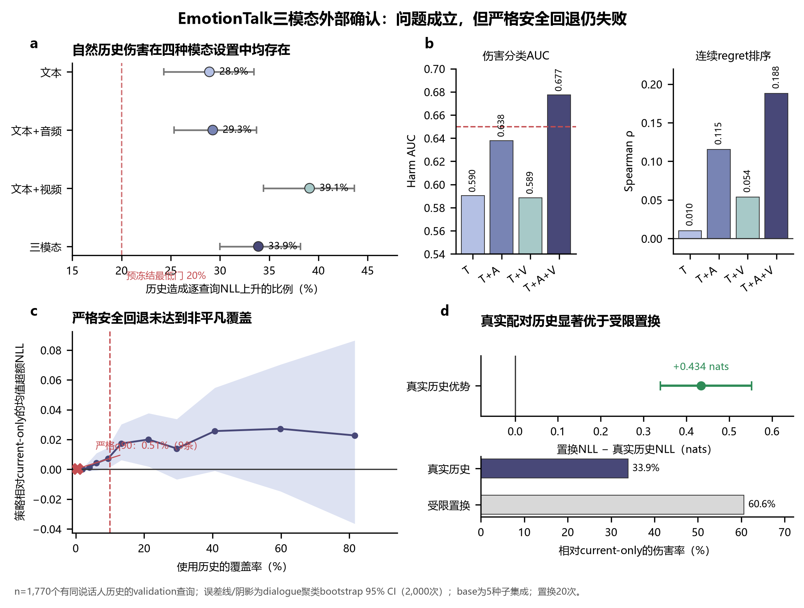

# CARMA-Affect：纵向个性化情感预测中的历史负迁移与安全回退

> 研究快照：2026-08-07<br>
> 当前结论：**历史负迁移问题成立；现有严格安全回退方法尚未成功。**<br>
> 数据边界：EmotionTalk validation 已完成一次性冻结评估；EmotionTalk test 与 MELD test 均保持封存。

本项目研究一个比“如何利用更多对话历史”更窄、更可证伪的问题：

> 在不知道当前真实情感标签的条件下，能否预测加入同说话人历史后会改善还是损害当前情感预测，并在损害风险较高时可靠地回退到 current-only 模型？

当前证据支持把研究推进为“历史负迁移 benchmark／诊断协议”，但**不支持**把现有 CARMA-Affect 写成已经成功的顶会方法。



## 当前科学结论

| 问题或判门 | 结果 | 主要证据 |
|---|---|---|
| 自然历史是否会伤害部分查询？ | **PASS** | EmotionTalk 三模态历史伤害率 33.90%，dialogue 聚类 95% CI 29.99%–38.18% |
| 多模态信号能否提高伤害预测？ | **PASS** | 三模态 selector harm AUC 0.6773；较文本提高 0.0871，95% CI 0.0508–0.1235 |
| 严格 q90 回退能否安全且非平凡地使用历史？ | **FAIL** | 仅使用 9/1,770 条历史，覆盖率 0.51%；策略均值 regret 的 95% CI 上界仍大于 0 |
| 真实历史配对是否具有特异性？ | **PASS** | 真实历史较 20 次受限置换历史平均降低 NLL 0.4339 nats，95% CI 0.3394–0.5525 |
| CARMA 方法论文路线 | **STOP** | 当前安全回退未通过预冻结门 |
| 历史负迁移 benchmark 路线 | **GO** | MELD 与 EmotionTalk 均复现逐查询伤害和尾部风险 |

完整结果与限制见[EmotionTalk 三模态外部确认报告](docs/05_EmotionTalk三模态外部确认结果.md)。

## 当前实际使用的模型

当前跑通的验证系统不是单一端到端 Transformer，而是可审计的组合流水线：

1. 文本：中文字符 2–5 gram TF-IDF；
2. 音频：冻结的 `microsoft/wavlm-base-plus`，时间均值与标准差得到 1,536 维表示，再在训练折内 PCA 到 96 维；
3. 视频：冻结的 `facebook/dinov2-small`，每段均匀抽 4 帧，使用人脸裁剪或全帧回退，CLS 均值与标准差得到 768 维表示，再 PCA 到 96 维；
4. 情感预测器：5 个随机种子集成的 `SGDClassifier(loss="log_loss")`，即 L2 正则化的线性多分类逻辑回归；
5. 风险 selector：5 种子 `HistGradientBoosting` 均值回归、q90 分位数回归和伤害分类器；
6. 安全门控：独立 calibration 上的 conformal q90 风险上界；只有预测上界小于 0 才使用历史，否则回退 current-only。

方法细节、输入特征和防泄漏合同见[当前实验方法与模型](docs/02_当前实验方法与模型.md)。

## 两个已完成的真实数据阶段

| 阶段 | 数据与模态 | 有历史评估查询 | 关键结果 | 决策 |
|---|---|---:|---|---|
| MELD Pilot | 官方文本＋真实音频轻量特征 | 765 | 历史伤害率 43.27%；轻量音频未提高 selector；严格 q90 全拒绝 | 方法 STOP，benchmark REVISE/GO |
| EmotionTalk 外部确认 | 官方文本＋WavLM音频＋DINOv2视频 | 1,770 | 历史伤害率 33.90%；三模态提高 selector；严格 q90 仅覆盖 0.51% 且安全性未证实 | 方法 STOP，benchmark GO |

这两个阶段回答的是“问题是否真实且可预测”，不是临床有效性、真实长期心理状态或可穿戴部署效果。

## 仓库结构

| 路径 | 内容 |
|---|---|
| [`docs/`](docs/) | 核心问题、研究定位、方法、数据集、进度、完整实验报告 |
| [`experiment/`](experiment/) | 当前 EmotionTalk 三模态验证代码、冻结配置和无数据合同测试 |
| [`results/`](results/) | 聚合结果 JSON、作图源数据和证据说明 |
| [`assets/`](assets/) | 目标方法框架图、实际流程图和冻结结果图 |
| [`DATA_BOUNDARY.md`](DATA_BOUNDARY.md) | 不得上传的数据、权重、特征和许可边界 |

建议阅读顺序：

1. [核心问题与研究定位](docs/01_核心问题与研究定位.md)
2. [当前实验方法与模型](docs/02_当前实验方法与模型.md)
3. [数据集与许可状态](docs/03_数据集与许可状态.md)
4. [EmotionTalk 三模态外部确认结果](docs/05_EmotionTalk三模态外部确认结果.md)
5. [当前进度与下一步](docs/06_当前进度与下一步.md)

## 最小代码验证

仓库不包含任何原始数据。无需数据即可运行合同测试：

```powershell
python -m pip install -r experiment/requirements-multimodal.txt
python -m pytest experiment/tests -q
```

完整复现需研究者自行按数据集许可取得 EmotionTalk 文件和预训练编码器。具体命令见 [`experiment/README.md`](experiment/README.md)。

## 结果解释边界

- 工程全流程跑通不等于方法假设成功；
- validation 一次性冻结结果不能继续调阈值后仍称为确认性证据；
- test 尚未打开；
- EmotionTalk 是演员对话，不能直接外推到临床、自然长期生活或可穿戴场景；
- 本仓库不包含原始文本、音频、视频、逐查询记录、模型 bundle 或派生特征。

本仓库当前用于科研协作与结果审计。所有论文主张仍需导师和共同作者复核。
