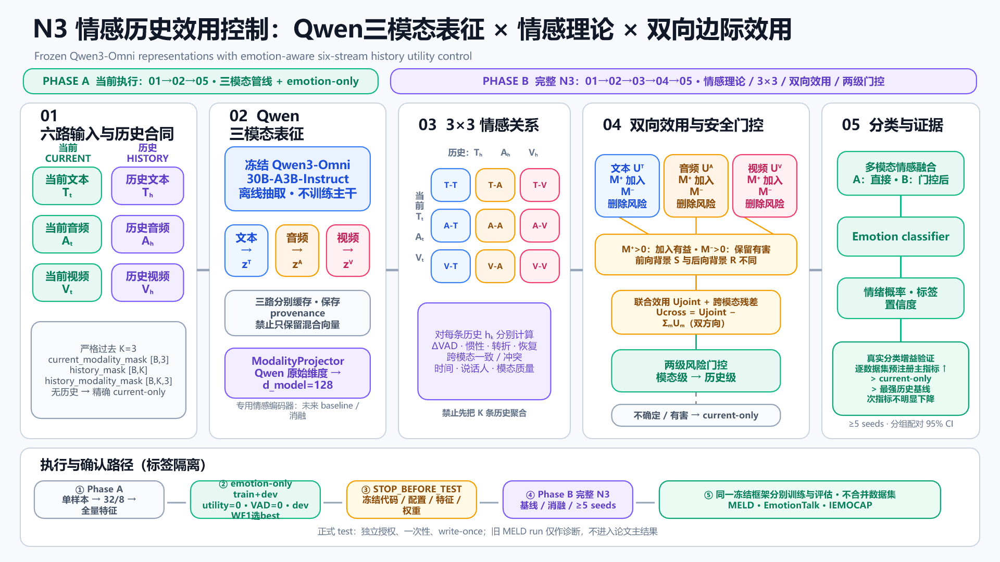

# N3 情感历史效用控制：六路建模 × 双向边际效用 × 真实分类增益

> **当前研究主线：N3 正向方法。** 本分支已经上传冻结协议、实验框架、接口合同、合成测试与可编辑流程图；它们证明框架可实现、边界可审计，**尚不等于已经证明真实数据性能提升**。<br>
> **HarmBench/ERC 的定位：**辅助评估、负迁移诊断与安全合同，不是当前主方法。<br>
> **最终判据：**N3 必须在严格冻结、无泄漏的真实情感分类实验中提高预注册指标；只提高效用预测 AUC、降低 RMSE 或通过工程测试都不算方法成功。

## 2026-08-13 当前两阶段执行方案（ACTIVE OVERRIDE）

最新实验方案分为两个不可混淆的阶段：

- **Phase A — Qwen 三模态管线与 emotion-only 基线。** 冻结 `Qwen3-Omni-30B-A3B-Instruct`，分别离线抽取文本、音频、视频特征；三路分别缓存并保留各自 provenance，禁止只保存不可拆分的混合向量。`ModalityProjector` 将三路特征投影到 `d_model=128`。历史只取严格过去 `K=3`，接口固定为 `current_modality_mask[B,3]`、`history_mask[B,K]`、`history_modality_mask[B,K,3]`；无合法历史时逐样本精确回退 current-only。Phase A 固定 `utility_loss_weight=0`、`vad_loss_weight=0`，按“单样本 → 32 train/8 dev 冒烟 → 全量特征 → train+dev”推进，以 dev Weighted-F1 选择 best，并停在 `STOP_BEFORE_TEST`。Phase A 只证明数据、特征和分类基线管线成立，**不证明完整 N3 创新有效**。
- **Phase B — 完整 N3 情感历史效用实验。** 对每个历史候选 `h_k (k=1,2,3)` 分别计算当前三模态与该候选历史三模态的 3×3 关系，禁止先把三条历史聚合成一个向量再计算一次 3×3。VAD、情感惯性、转折、恢复、跨模态冲突、时间、说话人和模态质量进入关系与门控；学习模态级和联合级真实双向边际效用，前向背景 `S` 与后向背景 `R` 必须不同；随后执行模态级、联合级两级门控和 current-only 回退。完整比较采用至少 5 个 seeds、分组配对 95% CI 及预注册的完整基线/消融。

当前状态：MELD 旧运行因视频 94.71% 全零和损失/评估合同错误被标记为 `invalid_preliminary_run`，正在修复重训；IEMOCAP 已获官方授权并通过归档、解压、Session1–5 和媒体完整性检查，下一步只做 manifest/Session 五折预检；EmotionTalk 新一轮原始数据仍在上传，尚未完成新管线审计。三数据集将使用同一冻结框架**分别训练和评估**，不是默认用一个数据集训练出的单一权重直接证明另外两个数据集有效。

完整的“做什么、怎么做、旧方案差异、逐数据集 Gate 与停止条件”见 [最新执行基线与 GitHub 旧方案差异](docs/14_最新执行基线与GitHub旧方案差异_2026-08-13.md)。下方旧协议内容仅用于解释 Phase B 的研究来源；凡与上述两阶段顺序、Qwen 三模态主干或数据集执行关系冲突之处，均不再作为当前执行口径。

**代码同步状态：未完成。** 当前 `模型/n3_affect/` 仍只把 Qwen 接入文本塔，音频/视频使用外部 sidecar 投影；`n3_train_v1.json` 仍是 utility/VAD 非零的旧配置，且正式数据 trainer 尚未实现最新 K=3 masks、dev Weighted-F1 best 与 `STOP_BEFORE_TEST`。因此当前仓库可作为最新执行说明和旧/新差异基线，不能直接视为已经完成的 Qwen 三模态重训实现。

N3 面向多模态对话情感识别，核心问题是：面对某条当前话语，应当从同一说话人的严格过去历史中保留哪些文本、音频和视频信息，哪些信息会造成负迁移，以及何时必须安全回退到只看当前话语的分类器。



可编辑源图：[PPTX](assets/n3_qwen_omni_experiment_workflow_20260813.pptx)。旧版流程图继续保留作历史追溯；完整的当前两阶段定义见 [最新执行基线](docs/14_最新执行基线与GitHub旧方案差异_2026-08-13.md)，Phase B 的历史设计来源见 [N3 候选方案：老师要求对照与冻结协议](docs/12_N3候选方案_要求对照与冻结协议_2026-08-09.md)。

## N3 两阶段实验框架

| 阶段 | 核心处理 | 输出与判定边界 |
|---|---|---|
| Phase A1. 冻结三模态提取 | Qwen3-Omni 分别离线提取 T/A/V；分路缓存、provenance 和三类 mask；`ModalityProjector → 128` | 证明每路特征来自冻结 Qwen 且可追溯，不把混合向量冒充三路证据 |
| Phase A2. 严格历史与基线训练 | 只用严格过去 `K=3`；无合法历史精确 current-only；emotion-only train+dev，dev Weighted-F1 选 best | 得到每个数据集自己的管线基线并停在 `STOP_BEFORE_TEST`；不作完整 N3 机制结论 |
| Phase B1. 候选级 3×3 与情感变量 | 对 `h_1`、`h_2`、`h_3` **逐候选**计算九种 T/A/V 当前—历史关系；加入 VAD、惯性、转折、恢复、冲突、时间、说话人和质量 | 保留候选和模态可归因性；禁止先聚合三条历史 |
| Phase B2. 真实双向边际效用 | 在不同的 `S`/`R` 背景下分别估计各候选的文本、音频、视频加入收益与删除风险，再估计联合效用和不可加残差 | `U_T/U_A/U_V`、`U_joint` 与 `U_cross` |
| Phase B3. 两级门控与确认 | 先做模态级门控，再做候选联合级门控；失败时精确回退 current-only；至少 5 seeds、分组配对 95% CI、完整基线/消融 | 只有真实分类指标和完整合取门通过，才支持 N3 有效性主张 |

### 双向边际效用处理什么

它不是只对“已经融合好的历史向量”做一次比较。N3 同时包含两层比较：

1. **模态级效用：**只改变候选历史的一种模态，分别计算文本、音频、视频历史的前向加入收益和后向删除风险；
2. **联合级效用：**同时改变该候选的三种模态，判断融合后的整体收益，并用 `U_cross` 表示联合效用不能被三个单模态效用简单相加解释的协同或冲突。

对候选历史 `h` 的模态 `m∈{T,A,V}`，冻结比较中其余模态和历史背景：

```text
M_m_forward  = loss(q; S_m) - loss(q; S_m + h^m)
M_m_backward = loss(q; R_m) - loss(q; R_m - h^m)
U_m = (M_m_forward, M_m_backward)
```

其中 `M_forward > 0` 表示加入该模态有益，`M_backward > 0` 表示删除后更好、继续保留该模态存在风险。前向背景与后向背景必须来自预注册的不同集合状态，禁止用同一差值改符号伪造“双向”。

## 为什么这是情感领域方法

N3 的任务、表示、理论约束和成功标准都绑定情感识别，而不是通用历史筛选：

- 主任务始终是当前话语的情绪分类，主损失为 `L_emotion`；
- 当前主干是冻结 Qwen3-Omni 的三路可审计表示；情感专用文本、音频和视觉编码器作为 Phase B 的公平 baseline/消融，用来检验结论是否依赖特定表征；
- VAD、情感惯性、情感转折、情感恢复和跨模态情绪冲突直接进入 3×3 关系层与门控层；
- 最终成功必须体现为真实 Accuracy、Weighted-F1 等情感分类指标提升，并通过去 VAD、去惯性/转折/恢复、去跨模态冲突、去双向效用、去两级门控等主模型组件消融验证；情感专用编码器只做替代表征 baseline，不作为当前 Qwen 主模型中可“移除”的组件。

因此，即使一个通用 selector 能预测“某段历史是否有用”，如果完整 N3 不能提高真实情感分类，它也不能支持本项目的核心主张。

## 确认性实验路径

```text
按 speaker/dialogue/session 分组交叉拟合
    ↓
只在 fit 内生成 N3 效用监督和 OOF 预测
    ↓
冻结源码、配置、指标、效应阈值、统计合同与 protocol SHA
    ↓
生成不含评估标签的 outcome-free 预测产物
    ↓
由一次性 label-only evaluator 计算最终结果
    ↓
MELD + EmotionTalk + IEMOCAP 外部确认（正负结果均报告）
```

主要规则：

- 以 speaker、dialogue 或 session 为统计和切分单位，禁止把同一人物或会话泄漏到训练与评估两侧；
- MELD 主指标预注册为 Weighted-F1，同时报告 Accuracy、Macro-F1、NLL、Brier、ECE、历史伤害率、CVaR 和风险—覆盖；
- 至少 5 个随机种子，并使用分组配对区间判断提升是否稳定；
- 完整 N3 必须优于 independent current-only 和最强历史基线，并在移除情感理论变量、模态级/联合双向效用、两级门控或逐候选 3×3 关系后出现预期下降；情感专用编码器以替代表征 baseline 单独比较；
- 已观察的模型选择结果只作探索性证据，不能在继续调参后包装成确认性成功。

## 数据集与当前角色

| 数据集 | N3 中的角色 | 当前状态 | 官方入口 |
|---|---|---|---|
| MELD | 标准英文多方对话基准；首个 Phase A 管线修复对象 | 原始数据可用；旧 run 为 `invalid_preliminary_run`；待修复后重训，test 封存 | [GitHub](https://github.com/declare-lab/MELD) |
| EmotionTalk | 中文三模态外部证据与较深同说话人历史 | 新一轮原始包上传中；尚未完成解压和新管线审计；旧结果仅作历史探索 | [GitHub](https://github.com/NKU-HLT/EmotionTalk) · [Hugging Face](https://huggingface.co/datasets/BAAI/Emotiontalk) |
| IEMOCAP | 第三个独立数据集；适合 session/speaker 隔离及情感转折/恢复 | 已获 USC 官方授权且归档/解压/媒体完整性 PASS；下一步做 manifest、标签和 Session 五折 preflight，尚未训练 | [USC](https://sail.usc.edu/iemocap/) · [Release](https://sail.usc.edu/iemocap/iemocap_release.htm) |

数据集的详细许可状态与备用顺序见 [数据集与许可状态](docs/03_数据集与许可状态.md)。IEMOCAP 不是可从非官方仓库随意下载或重新分发的数据；无学校邮箱不改变其授权要求。

## 数据与发布边界

完整规定见 [DATA_BOUNDARY.md](DATA_BOUNDARY.md)（科研协作版）。

**鼓励上传：**代码与配置；开源许可允许的预训练权重（本仓已放 EmoBERTa-base）；自训 N3 checkpoint；聚合指标；合成测试。

**底线禁止：**未获再分发权时镜像 MELD/EmotionTalk/IEMOCAP 等原始数据包；密钥与未脱敏隐私材料。

原始数据请用 [`datasets/`](datasets/) 在仓库外下载。自有/开源权重放 `模型/artifacts/`。

### 协作者如何取得数据

本项目对**原始数据集**仍采用“官方来源下载＋本地校验”。详细目录规范见 [官方数据获取与本地目录规范](datasets/README.md)。开源预训练权重可直接使用本仓 `模型/artifacts/pretrained/`。

```powershell
# 默认只取 MELD train/dev 标注；test 保持 evaluator-only
$dataRoot = 'D:\N3_data'
powershell -NoProfile -ExecutionPolicy Bypass -File datasets\scripts\download_official_data.ps1 `
  -Dataset MELD `
  -Destination (Join-Path $dataRoot 'MELD\e8cedf27b5d2877e198332c957127e16eb214afe')

# EmotionTalk 需先执行 hf auth login 并由本人接受 gated 条款
powershell -NoProfile -ExecutionPolicy Bypass -File datasets\scripts\download_official_data.ps1 `
  -Dataset EmotionTalk `
  -Destination (Join-Path $dataRoot 'EmotionTalk\adbc17fc944e8cf2873643906160c6ca0259ab61')
```

加入 `-IncludeMedia` 才会下载大体积音视频；MELD 的 `-IncludeTest` 只允许指定 evaluator 使用。下载所得 **原始** archive、标签和媒体仍不得提交进本仓；训好的**自有权重**按 `DATA_BOUNDARY.md` 可放入 `模型/artifacts/`。

## 快速验证框架

在 Windows PowerShell 中：

```powershell
python -m venv .venv
$python = (Resolve-Path '.venv\Scripts\python.exe').Path
& $python -m pip install --upgrade pip
& $python -m pip install -r experiment\requirements-harmbench.txt
& $python -m pytest experiment\tests\test_harmbench_erc*.py -q
```

当前已完成的框架测试结果为 **418 passed**，另有一个非阻断的 sklearn 零方差警告。该结果证明现有接口、泄漏防护和合同测试通过，不代表 N3 已经取得真实数据分类增益。

## 关键文件

- [最新 Phase A/Phase B 执行基线](docs/14_最新执行基线与GitHub旧方案差异_2026-08-13.md)：当前唯一执行顺序、逐数据集 Gate、实现差距与 test 边界；
- [最新两阶段流程图（PPTX）](assets/n3_qwen_omni_experiment_workflow_20260813.pptx)：可编辑的 Phase A/Phase B 架构与实验流程；
- [N3 要求对照与冻结协议](docs/12_N3候选方案_要求对照与冻结协议_2026-08-09.md)：六路表示、3×3 交互、双向效用、两级门控、成功门和外部确认规则；
- [前三项创新新颖性审计](docs/13_CARMA-Affect_前三项创新_新颖性审计_2026-08-07.md)：创新边界、相关工作映射与不可过度声称的内容；
- [N3/HarmBench 候选冻结配置](experiment/configs/harmbench_erc_v2_candidate.json)：当前机器可检验的候选配置；
- [依赖清单](experiment/requirements-harmbench.txt)：框架测试依赖；
- [数据与发布边界](DATA_BOUNDARY.md)：允许和禁止进入公开仓库的内容。

## 当前实现边界

以下是截至 2026-08-09 的历史实现边界（最新状态见本文顶部的 2026-08-13 基线）：

- N3 协议、框架图、配置合同和合成/防泄漏测试已经进入本分支；
- 六路真实 producer、三类情感领域编码器及完整真实数据训练流水线尚未全部完成；
- MELD 与 EmotionTalk 的官方 test 仍保持封存；
- IEMOCAP 已取得官方许可并通过归档/解压/媒体完整性检查，但 manifest、标签、Session 五折和 Qwen 单样本 preflight 尚未完成，仍未训练；
- 因此当前可以表述为“**N3 实验框架已搭建并冻结关键合同**”，不能表述为“**N3 已被证明有效**”。

本分支下一步先关闭 Phase A 的 Qwen 三模态 producer、K=3/mask、emotion-only trainer、dev Weighted-F1 best 与 test-deny 实现差距；各数据集 Phase A 通过后，再实现并审计 Phase B 的逐 `h_k` 3×3、情感变量、真实双向效用和两级门控。正式 test 仍须逐数据集独立授权、一次性且 write-once。
