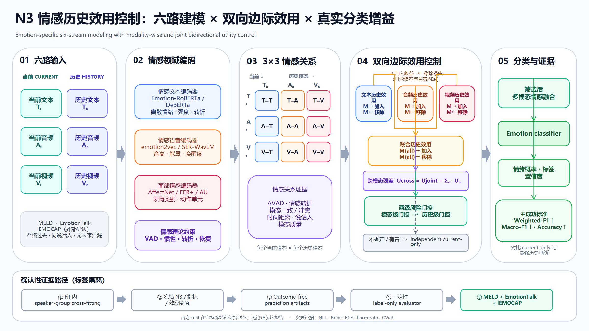

# N3 情感历史效用控制：六路建模 × 双向边际效用 × 真实分类增益

> **当前研究主线：N3 正向方法。** 本分支已经上传冻结协议、实验框架、接口合同、合成测试与可编辑流程图；它们证明框架可实现、边界可审计，**尚不等于已经证明真实数据性能提升**。<br>
> **HarmBench/ERC 的定位：**辅助评估、负迁移诊断与安全合同，不是当前主方法。<br>
> **最终判据：**N3 必须在严格冻结、无泄漏的真实情感分类实验中提高预注册指标；只提高效用预测 AUC、降低 RMSE 或通过工程测试都不算方法成功。

## 2026-08-13 当前执行基线（优先于下方历史说明）

最新老师决定是：**文本、音频、视频均由冻结的 `Qwen3-Omni-30B-A3B-Instruct` 离线抽取，并保持当前/历史的 T/A/V 六路表示**。历史固定为严格过去 `K=3`；第一轮只训练 emotion classification，`utility_loss_weight=0`、`vad_loss_weight=0`，按 dev Weighted-F1 选择 best，并在正式 test 前强制停止。旧的情感专用编码器方案保留为后续 baseline/消融。

当前状态：MELD 旧运行因视频 94.71% 全零和损失/评估合同错误被标记为 `invalid_preliminary_run`，正在修复重训；IEMOCAP 已获官方授权并通过归档、解压、Session1–5 和媒体完整性检查，下一步只做 manifest/Session 五折预检；EmotionTalk 新一轮原始数据仍在上传，尚未完成新管线审计。三数据集将使用同一冻结框架**分别训练和评估**，不是默认用一个数据集训练出的单一权重直接证明另外两个数据集有效。

完整的“做什么、怎么做、旧方案差异、逐数据集 Gate 与停止条件”见 [最新执行基线与 GitHub 旧方案差异](docs/14_最新执行基线与GitHub旧方案差异_2026-08-13.md)。下方内容保留为 2026-08-09 历史设计记录；与新基线冲突之处以该文档为准。

**代码同步状态：未完成。** 当前 `模型/n3_affect/` 仍只把 Qwen 接入文本塔，音频/视频使用外部 sidecar 投影；`n3_train_v1.json` 仍是 utility/VAD 非零的旧配置，且正式数据 trainer 尚未实现最新 K=3 masks、dev Weighted-F1 best 与 `STOP_BEFORE_TEST`。因此当前仓库可作为最新执行说明和旧/新差异基线，不能直接视为已经完成的 Qwen 三模态重训实现。

N3 面向多模态对话情感识别，核心问题是：面对某条当前话语，应当从同一说话人的严格过去历史中保留哪些文本、音频和视频信息，哪些信息会造成负迁移，以及何时必须安全回退到只看当前话语的分类器。



可编辑源图：[PPTX](assets/n3_emotion_history_utility_workflow_20260809.pptx)。完整定义与冻结门见 [N3 候选方案：老师要求对照与冻结协议](docs/12_N3候选方案_要求对照与冻结协议_2026-08-09.md)。

## N3 实验框架

| 阶段 | 核心处理 | 输出与作用 |
|---|---|---|
| 1. 六路输入 | 当前 `T_t/A_t/V_t` 与严格过去历史 `T_h/A_h/V_h` 分路保持，不先把三模态压成一个历史向量 | 六路可独立审计的当前/历史表示 |
| 2. 情感领域建模 | 文本、音频、视频优先采用情感识别领域编码器；同时构造离散情绪后验、VAD、情感惯性、转折、恢复、跨模态冲突、时间、说话人和质量变量 | 明确把情感理论和情感领域模型放入表示层与门控层 |
| 3. 共享 3×3 关系 | 建模 T–T、T–A、T–V、A–T、A–A、A–V、V–T、V–A、V–V 九种当前—历史关系，并使用共享主体控制参数量 | 当前三模态与历史三模态的同模态、跨模态关系 |
| 4. 双向边际效用 | 分别估计文本、音频、视频的加入收益与删除风险，再估计联合效用和不可加的协同/冲突残差 | `U_T/U_A/U_V`、`U_joint` 与 `U_cross` |
| 5. 两级风险门控 | 先做模态级门控，允许只保留一条历史中的可靠模态；再做整条历史的联合风险门控，不满足冻结条件时回退 current-only | 受控历史表示、最终情绪概率和类别 |

### 双向边际效用处理什么

它不是只对“已经融合好的历史向量”做一次比较。N3 同时包含两层比较：

1. **模态级效用：**只改变候选历史的一种模态，分别计算文本、音频、视频历史的前向加入收益和后向删除风险；
2. **联合级效用：**同时改变该候选的三种模态，判断融合后的整体收益，并用 `U_cross` 表示联合效用不能被三个单模态效用简单相加解释的协同或冲突。

对候选历史 `h` 的模态 `m∈{T,A,V}`，冻结比较中其余模态和历史背景：

```text
M_m_forward  = loss(q; S_m) - loss(q; S_m + h^m)
M_m_backward = loss(q; R_m) - loss(q; R_m - h^m)
U_m = (M_m_forward, M_m_backward)
```

其中 `M_forward > 0` 表示加入该模态有益，`M_backward > 0` 表示删除后更好、继续保留该模态存在风险。前向背景与后向背景必须来自预注册的不同集合状态，禁止用同一差值改符号伪造“双向”。

## 为什么这是情感领域方法

N3 的任务、表示、理论约束和成功标准都绑定情感识别，而不是通用历史筛选：

- 主任务始终是当前话语的情绪分类，主损失为 `L_emotion`；
- 三路编码器优先采用情感微调文本模型、SER/emotion2vec 类音频模型及 AffectNet/FERPlus/AU 类视觉模型，通用编码器仅作为公平基线；
- VAD、情感惯性、情感转折、情感恢复和跨模态情绪冲突直接进入 3×3 关系层与门控层；
- 最终成功必须体现为真实 Accuracy、Weighted-F1 等情感分类指标提升，并通过去情感编码器、去 VAD、去转折、去冲突等消融验证。

因此，即使一个通用 selector 能预测“某段历史是否有用”，如果完整 N3 不能提高真实情感分类，它也不能支持本项目的核心主张。

## 确认性实验路径

```text
按 speaker/dialogue/session 分组交叉拟合
    ↓
只在 fit 内生成 N3 效用监督和 OOF 预测
    ↓
冻结源码、配置、指标、效应阈值、统计合同与 protocol SHA
    ↓
生成不含评估标签的 outcome-free 预测产物
    ↓
由一次性 label-only evaluator 计算最终结果
    ↓
MELD + EmotionTalk + IEMOCAP 外部确认（正负结果均报告）
```

主要规则：

- 以 speaker、dialogue 或 session 为统计和切分单位，禁止把同一人物或会话泄漏到训练与评估两侧；
- MELD 主指标预注册为 Weighted-F1，同时报告 Accuracy、Macro-F1、NLL、Brier、ECE、历史伤害率、CVaR 和风险—覆盖；
- 至少 5 个随机种子，并使用分组配对区间判断提升是否稳定；
- 完整 N3 必须优于 independent current-only 和最强历史基线，并在移除情感编码器、模态级/联合双向效用或 3×3 关系后出现预期下降；
- 已观察的模型选择结果只作探索性证据，不能在继续调参后包装成确认性成功。

## 数据集与当前角色

| 数据集 | N3 中的角色 | 当前状态 | 官方入口 |
|---|---|---|---|
| MELD | 标准英文多方对话基准；建立 train/development 证据 | 文本＋真实音频 Pilot 已完成；官方 test 继续封存 | [GitHub](https://github.com/declare-lab/MELD) |
| EmotionTalk | 中文三模态外部证据与较深同说话人历史 | train/validation 已形成探索性证据；official test 继续封存 | [GitHub](https://github.com/NKU-HLT/EmotionTalk) · [Hugging Face](https://huggingface.co/datasets/BAAI/Emotiontalk) |
| IEMOCAP | 计划中的第三个独立确认集；适合 session/speaker 隔离及情感转折/恢复 | 尚未运行；必须先获得 USC 官方授权并冻结标签协议 | [USC](https://sail.usc.edu/iemocap/) · [Release](https://sail.usc.edu/iemocap/iemocap_release.htm) |

数据集的详细许可状态与备用顺序见 [数据集与许可状态](docs/03_数据集与许可状态.md)。IEMOCAP 不是可从非官方仓库随意下载或重新分发的数据；无学校邮箱不改变其授权要求。

## 数据与发布边界

完整规定见 [DATA_BOUNDARY.md](DATA_BOUNDARY.md)（科研协作版）。

**鼓励上传：**代码与配置；开源许可允许的预训练权重（本仓已放 EmoBERTa-base）；自训 N3 checkpoint；聚合指标；合成测试。

**底线禁止：**未获再分发权时镜像 MELD/EmotionTalk/IEMOCAP 等原始数据包；密钥与未脱敏隐私材料。

原始数据请用 [`datasets/`](datasets/) 在仓库外下载。自有/开源权重放 `模型/artifacts/`。

### 协作者如何取得数据

本项目对**原始数据集**仍采用“官方来源下载＋本地校验”。详细目录规范见 [官方数据获取与本地目录规范](datasets/README.md)。开源预训练权重可直接使用本仓 `模型/artifacts/pretrained/`。

```powershell
# 默认只取 MELD train/dev 标注；test 保持 evaluator-only
$dataRoot = 'D:\N3_data'
powershell -NoProfile -ExecutionPolicy Bypass -File datasets\scripts\download_official_data.ps1 `
  -Dataset MELD `
  -Destination (Join-Path $dataRoot 'MELD\e8cedf27b5d2877e198332c957127e16eb214afe')

# EmotionTalk 需先执行 hf auth login 并由本人接受 gated 条款
powershell -NoProfile -ExecutionPolicy Bypass -File datasets\scripts\download_official_data.ps1 `
  -Dataset EmotionTalk `
  -Destination (Join-Path $dataRoot 'EmotionTalk\adbc17fc944e8cf2873643906160c6ca0259ab61')
```

加入 `-IncludeMedia` 才会下载大体积音视频；MELD 的 `-IncludeTest` 只允许指定 evaluator 使用。下载所得 **原始** archive、标签和媒体仍不得提交进本仓；训好的**自有权重**按 `DATA_BOUNDARY.md` 可放入 `模型/artifacts/`。

## 快速验证框架

在 Windows PowerShell 中：

```powershell
python -m venv .venv
$python = (Resolve-Path '.venv\Scripts\python.exe').Path
& $python -m pip install --upgrade pip
& $python -m pip install -r experiment\requirements-harmbench.txt
& $python -m pytest experiment\tests\test_harmbench_erc*.py -q
```

当前已完成的框架测试结果为 **418 passed**，另有一个非阻断的 sklearn 零方差警告。该结果证明现有接口、泄漏防护和合同测试通过，不代表 N3 已经取得真实数据分类增益。

## 关键文件

- [N3 要求对照与冻结协议](docs/12_N3候选方案_要求对照与冻结协议_2026-08-09.md)：六路表示、3×3 交互、双向效用、两级门控、成功门和外部确认规则；
- [前三项创新新颖性审计](docs/13_CARMA-Affect_前三项创新_新颖性审计_2026-08-07.md)：创新边界、相关工作映射与不可过度声称的内容；
- [N3/HarmBench 候选冻结配置](experiment/configs/harmbench_erc_v2_candidate.json)：当前机器可检验的候选配置；
- [依赖清单](experiment/requirements-harmbench.txt)：框架测试依赖；
- [数据与发布边界](DATA_BOUNDARY.md)：允许和禁止进入公开仓库的内容。

## 当前实现边界

以下是截至 2026-08-09 的历史实现边界（最新状态见本文顶部的 2026-08-13 基线）：

- N3 协议、框架图、配置合同和合成/防泄漏测试已经进入本分支；
- 六路真实 producer、三类情感领域编码器及完整真实数据训练流水线尚未全部完成；
- MELD 与 EmotionTalk 的官方 test 仍保持封存；
- IEMOCAP 尚未运行，必须先取得官方许可；
- 因此当前可以表述为“**N3 实验框架已搭建并冻结关键合同**”，不能表述为“**N3 已被证明有效**”。

本分支的下一阶段目标是实现真实六路 producer 与训练管线，在不读取封存标签的前提下完成 fit-only/group-OOF 开发，冻结后再执行一次性确认性评估。
