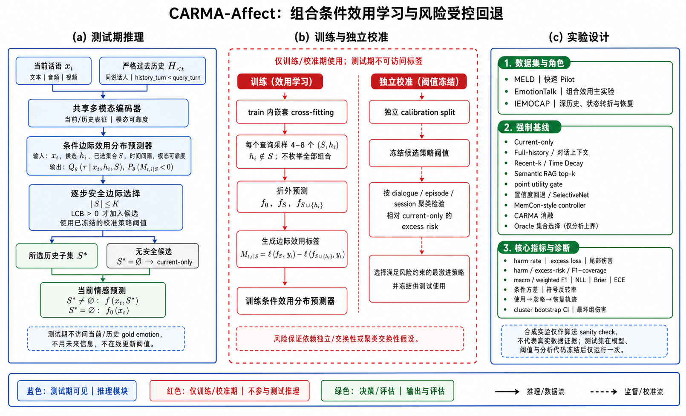

# 当前实验方法与模型

> **历史实现说明（截至 2026-08-07）：**本文描述的是旧 EmotionTalk/历史负迁移验证系统，不是 2026-08-13 的 Qwen 三模态重训实现。最新主线、旧/新差异和尚未关闭的代码缺口见 [最新执行基线](14_最新执行基线与GitHub旧方案差异_2026-08-13.md)。本文的 TF-IDF/WavLM/DINOv2 表示继续作为历史证据或 baseline，不得误写为本轮主线。

## 1. 先区分目标框架与已实现系统

下图是完整 CARMA-Affect 的目标研究框架，包含逐候选/集合条件效用预测、逐步安全选择和 current-only 回退。它用于说明后续方法方向，**不代表所有模块已经在当前实验中实现。**



当前实际跑通的是一个更保守的验证系统：冻结预训练表征＋线性情感分类器＋梯度提升风险 selector＋conformal q90 门控。它优先验证研究问题，而不是用复杂端到端网络追求最高情感识别分数。

## 2. 输入与严格历史

每个查询包含当前话语的文本、音频和视频。历史只允许来自：

- 同一个 dialogue；
- 同一个 speaker；
- turn 严格早于当前查询；
- 当前模型推理时实际可见的观测。

历史不输入 gold emotion，未来话语和 test 派生信息均禁止进入模型。历史表示为该说话人全部严格过去特征的均值，并附加 `log(1 + 历史条数)`。

## 3. 三模态表示

| 模态 | 当前实现 | 维度与处理 |
|---|---|---|
| 文本 | 字符级 TF-IDF | 2–5 gram，最多25,000特征；每个cross-fit折只在fit dialogue拟合 |
| 音频 | 冻结 `microsoft/wavlm-base-plus` | 最后隐藏层时间均值＋标准差，1,536维；折内标准化和PCA到96维 |
| 视频 | 冻结 `facebook/dinov2-small` | 4个均匀帧；最大正脸裁剪，无脸时全帧；CLS均值＋标准差768维；PCA到96维 |

两个预训练编码器均未使用 EmotionTalk 情感标签微调。

## 4. 情感预测器

情感预测器是 5 个随机种子集成的 `SGDClassifier`：

```text
loss = log_loss
penalty = l2
alpha = 1e-5
class_weight = balanced
average = true
max_iter = 1500
```

由于损失为 `log_loss`，它本质上是以随机梯度下降训练的线性多分类逻辑回归。输出 EmotionTalk 七类情感概率：neutral、happy、sad、angry、surprised、disgusted、fearful。

同一个分类器联合看到两种同维输入：

- `current-only`：历史块和历史计数置零；
- `full-history`：当前特征＋同说话人历史均值＋历史计数。

这种设计尽量把差异限制在“是否加入历史”，而不是比较两套容量不同的模型。

## 5. 风险 selector

selector 的监督目标为：

\[
\Delta L=NLL(\text{full-history})-NLL(\text{current-only}).
\]

selector 输入仅含测试时可见量：

- current-only/full-history 类别概率、熵、margin和概率位移；
- 当前与历史的余弦相似度、L2距离、范数与范数差；
- 历史数量；
- 音频时长、采样率、声道等质量字段；
- 视频人脸检出率、裁剪面积、帧数等质量字段。

每个模态消融均训练三类 5 种子 `HistGradientBoosting` 模型：

1. 均值回归器预测连续 \(\Delta L\)；
2. q90 分位数回归器预测保守风险上界；
3. 分类器预测 \(P(\Delta L>0)\)。

风险模型的主要参数为 learning rate 0.05、200 iterations、最多15个叶节点、每叶至少30条样本、L2正则0.1。

## 6. Cross-fitting、校准与一次性验证

1. train 按 dialogue 做 5 折 GroupKFold；
2. 每折的 TF-IDF、标准化、PCA 和 base 模型只在 fit dialogue 拟合；
3. held-out dialogue 产生 current/full 概率和 cross-fit \(\Delta L\)；
4. 有历史的 OOF 查询再按 dialogue 分为 selector-fit 11,341 条和独立 calibration 2,901 条；
5. q90 预测用 calibration 残差做 conformal 修正；
6. 配置、代码、特征和 bundle 哈希冻结后，validation 只运行一次；
7. EmotionTalk test 继续封存。

主安全规则为：

\[
\widehat{U}_{0.90}(\Delta L_t)<0
\Rightarrow \text{使用历史};
\quad
\text{否则回退 current-only}.
\]

## 7. 当前实现与完整CARMA的差距

当前 selector 判断“整体历史聚合表示”是否有害，还没有完成：

- 对每一条候选历史的条件边际效用分布；
- 组合历史集合之间的交互与非加性；
- 逐步集合构造和可逆重用；
- 更强且经过train-only校准的端到端多模态base；
- speaker/session级外部泛化保证。

因此当前代码是研究假设验证基线，不应被描述成最终顶会模型。
