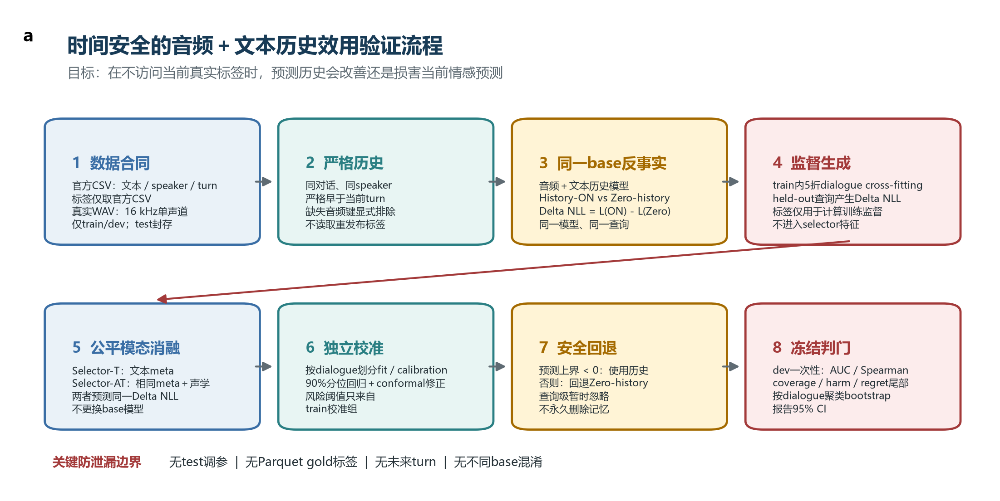
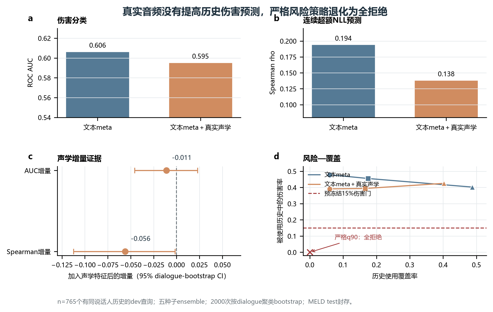

# CARMA-Affect真实音频＋文本全流程可行性终判报告

> **历史结果警告：**本文是 2026-08-06 的旧 Pilot 报告，不是当前 Qwen 文本/音频/视频重训结果。2026-08-13 复核已将随后一轮 MELD 运行标为 `invalid_preliminary_run`；旧数字仅用于诊断，不进论文、不用于调参。当前步骤见 [最新执行基线](14_最新执行基线与GitHub旧方案差异_2026-08-13.md)。

副标题：时间安全的逐查询历史效用学习与安全回退验证

版本：2026-08-06｜状态：内部科研决策稿｜数据边界：MELD train/dev，test封存

## 给老师的一句话结论

全流程已经在真实MELD音频＋官方文本上跑通并可逐字节复现，但预冻结的两个核心门均失败：真实声学特征没有提高历史伤害预测，严格90%风险上界又退化为全拒绝。因此，当前CARMA-Affect不应继续包装成“可投顶会的方法创新”；更诚实且更有潜力的出口，是把已稳定复现的自然负迁移、逐查询伤害和安全评测协议重构为历史负迁移benchmark，并在取得IEMOCAP／EmotionTalk授权后用更强预训练音频表征做外部确认。

## 决策摘要

| 决策对象 | 结论 | 依据 |
|---|---|---|
| 当前CARMA-Affect方法路线 | STOP | 音频增量门与校准安全回退门均FAIL |
| “声学信息能提升历史效用预测” | 当前实现不支持 | AUC增量-0.011，Spearman增量-0.056 |
| “可校准地安全使用部分历史” | 不支持 | 严格q90策略覆盖率0，等价于全拒绝 |
| 历史负迁移问题是否真实存在 | 支持 | 43.27%有历史查询受损，95% CI 39.39%–47.23% |
| 工程与统计流程是否跑通 | 支持 | 25项测试通过；独立重复结果逐字节相同 |
| 下一论文定位 | REVISE／有条件GO | 转历史负迁移benchmark；需外部数据与强表征确认 |

## 1 研究核心问题

本轮不再把“历史是否适用”或“动态决定是否检索记忆”本身作为创新。真正检验的问题是：

> 在不访问当前真实情感标签的条件下，能否用严格时间安全的预测证据，预测加入同说话人个人历史后会改善还是损害当前情感预测，并在损害风险较高时可靠回退到zero-history模型？

为避免把“更强的情感分类器”误当成“更强的效用预测器”，文本selector与音频增强selector预测完全相同的音频＋文本base模型逐查询超额NLL目标。

## 2 已执行的全流程



图1｜实际执行的时间安全流程。第三方Parquet只传输真实WAV；gold标签、speaker、turn和文本均来自官方CSV。两类selector使用同一base反事实目标，阈值只在train内独立group calibration上确定。

### 2.1 数据合同

- 使用MELD官方train/dev CSV；MELD test标签和test Parquet均未打开。
- 音频来自公开重发布的真实WAV传输分片，训练与开发分片均通过长度和SHA-256核对。
- train共有9,988条可对齐样本，dev共有1,108条；官方各有1条缺失音频：train `dia125_utt3.mp4`，dev `dia110_utt7.mp4`。
- 所有WAV均为16 kHz单声道；平均时长约3.14秒；声学表征为35维、无标签的波形／能量／过零率／频谱统计。
- 重发布转写与官方文本规范化匹配率约96.8%／96.6%，但模型文本一律取官方CSV，避免版本漂移。

### 2.2 时间与防泄漏合同

- 历史必须同时满足：同一dialogue、同一speaker、`Utterance_ID`严格小于当前查询。
- 向量化器、音频标准化器和base模型只在相应训练折拟合。
- train内按dialogue做五折cross-fitting，held-out查询产生超额NLL监督。
- selector输入不含当前gold标签；gold标签只用于计算训练目标和冻结评估指标。
- selector-fit与风险校准按dialogue独立划分；dev只作一次冻结路线判门。

### 2.3 反事实和模型

同一个音频＋文本历史模型分别得到History-ON和Zero-history预测：

`Delta NLL = NLL(History-ON) - NLL(Zero-history)`

- `Delta NLL > 0`：历史损害当前预测；
- `Delta NLL < 0`：历史改善当前预测。

最终base与风险模型均使用5个随机种子ensemble。文本selector使用历史计数、文本相似度、History-ON／Zero-history概率、置信度、熵和概率位移；音频增强selector在完全相同特征上增加当前／历史／差异声学特征。

### 2.4 预冻结统计判门

- 音频增量门：harm AUC至少提高0.02，连续效用Spearman至少提高0.05，且两项dialogue聚类bootstrap 95% CI下界均大于0。
- 安全回退门：严格90%风险上界策略覆盖率至少10%，被使用历史中的伤害率不高于15%，平均超额NLL及其95% CI上界不高于0。
- 置信区间：2000次按dialogue聚类bootstrap，保留对话内依赖。

## 3 主要结果



图2｜同一多模态效用目标上的公平消融。音频增强selector未超过文本meta；严格q90策略位于原点，表示全拒绝历史，而不是成功的非平凡安全策略。

### 3.1 Base预测和自然负迁移

| 模型 | Accuracy | Weighted-F1 | Macro-F1 | NLL |
|---|---:|---:|---:|---:|
| Current-only独立模型 | 0.4783 | 0.4336 | 0.2949 | 5.7563 |
| 同一历史模型的Zero-history | 0.4783 | 0.4284 | 0.2813 | 4.9364 |
| Full-history | 0.4720 | 0.4234 | 0.2776 | 4.9899 |

在765个具有同说话人历史的dev查询上：

- 43.27%查询因加入历史而NLL上升，dialogue聚类95% CI为39.39%–47.23%。
- 平均超额NLL为+0.084 nats，95% CI为-0.061至+0.227；均值证据不排除0，不能声称历史整体显著有害。
- 受损查询的平均伤害幅度为1.078 nats，95% CI为0.891–1.259。
- 上述区间由有历史查询所在的103个dialogue做2,000次聚类bootstrap得到，固定seed=20260805；精确值和计算过程保存在完成性审计JSON中。
- 超额NLL的p90为1.623、p99为4.555，表明均值附近的微小变化掩盖了实质性尾部风险。

这支持“负迁移是稳定存在且值得研究的尾部问题”，但不支持“所有历史平均上都有害”。

### 3.2 效用预测：音频没有提供增量

| Selector | Harm AUC | Balanced Accuracy | 连续效用Spearman |
|---|---:|---:|---:|
| 文本meta | 0.6065 | 0.5701 | 0.1944 |
| 文本meta＋真实声学 | 0.5954 | 0.5671 | 0.1385 |

声学增量结果：

- AUC增量=-0.0111，95% CI为-0.0457至+0.0230；未达到+0.02门，且区间跨0。
- Spearman增量=-0.0560，95% CI为-0.1123至-0.0017；不仅未达到+0.05门，而且区间完全位于0以下。

因此，在当前35维无标签声学表征下，音频没有提高历史效用／伤害预测，反而降低了连续目标排序能力。该结论只约束当前表征与模型，不应外推为“所有预训练音频编码器都无效”。

### 3.3 安全回退仍未成立

严格conformal q90策略对两个selector都给出0覆盖率，即所有查询都回退Zero-history。它在形式上避免伤害，但没有使用任何历史，不构成非平凡安全个性化。

放宽到校准目标覆盖策略后，音频增强selector的实际覆盖率为6.0%、16.6%和40.3%，但被使用历史中的伤害率仍为39.1%、39.4%和42.5%，远高于预冻结15%门。部分策略的全体eligible平均NLL改善，不能抵消其被选历史仍高频伤害的事实。

## 4 为什么这个结论可信

### 4.1 数据来源可追溯

- train音频NPZ SHA-256：`0c2690b49fb68cc962962c031b5d28f9dd89261e68f8d46331b9b1631b8ee29d`。
- dev音频NPZ SHA-256：`93c2fa7fb08d253cba9eb1242e22bc428f8010b3af0625e720586e9f5e205c79`。
- 冻结结果JSON SHA-256：`ccc6b1937e7d68eda9033c646152e472d1c294cc76c3e60a6a88cdae94f51943`。
- 所有缺失键显式披露，没有静默补值、删除unexpected键或读取第三方gold标签。

### 4.2 统计单位与假设匹配

逐查询超额NLL分布高度偏斜且有重尾，查询又嵌套在dialogue中；因此没有依赖独立同分布的普通t检验，而是报告分位数、Spearman以及按dialogue聚类bootstrap置信区间。AUC和Spearman的音频增量在同一重采样中配对计算，减少了不同样本造成的比较噪声。

### 4.3 结果确定性复现

使用相同冻结配置独立重复运行后：

- 两份结果JSON逐字节完全相同，SHA-256一致；
- 两份逐查询表均为1,108行×15列，逐值完全相同；
- 所有数值列最大绝对差为0；
- 全套25项单元／合同测试再次通过。

## 5 必须向老师主动说明的限制

### 5.1 这是真实双模态，不是三模态

本轮只有真实音频＋官方文本。重发布数据的`video`列只是文件名字符串，不含视觉字节；完整公开视觉候选约118 GB，当前资源下未取得可审计紧凑视觉特征。因此不能写“三模态实验已完成”。

### 5.2 声学表征仍是轻量基线

35维手工声学特征覆盖能量、时长、过零率和频谱统计，但不是WavLM／wav2vec2等预训练语音表示。当前结果能否定“轻量声学即可救活效用预测”，不能否定所有高容量语音编码器。

### 5.3 Base概率校准较弱

dev ECE约0.41，NLL分布存在概率饱和：有历史查询中Zero-history／Full-history分别有32／33条达到约27.63的损失上限。虽然比较使用同一模型的配对反事实并报告了Brier、分位数和bootstrap，但高NLL说明后续正式论文必须使用train-only温度缩放、Dirichlet calibration或更稳定的神经base，再重新生成效用监督。

### 5.4 目前只有单一外部开发集

MELD的同说话人历史较浅，且train/dev来自同一影视域。IEMOCAP需要USC许可，EmotionTalk需要用户本人完成Hugging Face gated授权；未获授权前不能伪造跨数据集确认。当前不能据此作顶会级普适性主张。

### 5.5 冻结dev已经使用

本轮dev已完成一次冻结判门。此后不能继续在同一dev上换阈值、挑子组或反复选择表示后仍声称确认性结果；任何新表示实验必须标为探索性，或转到新的授权数据集做确认。

## 6 对当前顶会可行性的终判

### 6.1 方法型顶会论文：当前不建议继续

审稿人最可能提出三项致命质疑：

- 核心门未通过：音频不增益，严格安全策略全拒绝。
- 结果只在单一数据集和轻量表征上成立，无法支撑普适方法主张。
- base校准较弱，使NLL效用监督含有明显尾部噪声。

因此，当前可行性评为低到中等，不应以现有结果继续扩写CARMA-Affect方法论文。

### 6.2 Benchmark／问题论文：有条件可行

已稳定成立且可形成论文骨架的部分是：

- 自然历史在大量查询上造成负迁移，且伤害呈重尾；
- 平均性能改善／接近不变，不能代表逐个体安全；
- 严格安全回退容易退化为全拒绝，非严格策略又保留高伤害率；
- 时间切分、逐查询反事实、风险—覆盖、p90／p99 regret和聚类CI构成一套可复现实验协议。

建议把下一版核心问题改为：

> 现有纵向／对话情感模型在什么条件下被个人历史伤害，常见平均指标为什么掩盖这种伤害，以及怎样建立时间安全、逐查询、尾部风险导向的统一评测基准？

这一路线不再承诺当前selector已经解决问题，而是把“历史负迁移的测量、审计和不可忽略性”作为主要贡献。

## 7 下一步最低成本路线

1. 停止在MELD dev上继续调门控与阈值。
2. 用户本人完成EmotionTalk gated授权并提交IEMOCAP申请；未获许可前只准备代码合同。
3. 在新数据集上预注册：预训练音频表示、train-only概率校准、外部确认门、speaker/session切分和尾部指标。
4. 将当前代码整理为benchmark工具：统一生成Current-only、History-ON、Zero-history、逐查询regret和风险—覆盖曲线。
5. 只有当新数据上的音频增量和非平凡安全回退均通过预注册门，才重新考虑方法型投稿；否则直接按benchmark／negative-result定位写作。

## 8 最小复现命令

安装依赖并运行测试：

```powershell
.\experiment\.venv\Scripts\python.exe -m pip install -r .\experiment\requirements-multimodal.txt
.\experiment\.venv\Scripts\python.exe -m pytest .\experiment\tests -q
```

运行真实音频＋文本冻结实验：

```powershell
.\experiment\.venv\Scripts\python.exe .\experiment\scripts\run_meld_audio_text_risk.py `
  --train-csv <MELD标签目录>\train_sent_emo.csv `
  --dev-csv <MELD标签目录>\dev_sent_emo.csv `
  --train-audio <派生特征目录>\meld_train_audio_handcrafted_v1.npz `
  --dev-audio <派生特征目录>\meld_dev_audio_handcrafted_v1.npz
```

重新生成投稿级图件：

```powershell
.\experiment\.venv\Scripts\python.exe .\experiment\figures\plot_workflow.py
.\experiment\.venv\Scripts\python.exe .\experiment\figures\plot_results.py
```

## 9 证据文件索引

- 数据预检：`experiment/artifacts/meld_audio_text_preflight_v1.json`
- 冻结结果：`experiment/artifacts/meld_audio_text_risk_v1.json`
- 逐查询结果：`experiment/artifacts/meld_audio_text_risk_v1_per_query.csv.gz`
- 重复性审计：`experiment/artifacts/repro_check/reproducibility_audit.json`
- 冻结配置：`experiment/configs/meld_audio_text_feasibility_v1.json`
- 流程图与结果图：`experiment/figures/exports/`

## 10 最终结论

本轮已经完成“数据可得—合同审计—真实音频提取—时间安全建模—cross-fitting—独立校准—冻结dev判门—聚类统计—重复运行—投稿级制图”的全流程。工程目标达成，科研假设没有被数据支持。当前最可信的决策不是继续修饰CARMA-Affect，而是停止方法型主张，保留真实负迁移与尾部风险证据，转向更窄、更可证伪的benchmark研究，并等待授权数据集完成外部确认。
