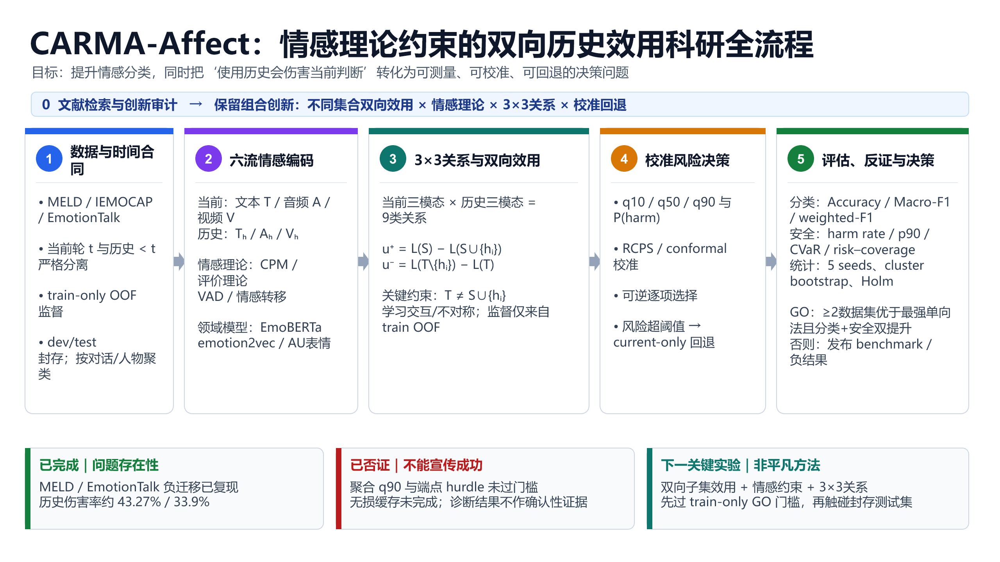

# 教师三点整合后的 CARMA-Affect 科研全流程

> **HISTORICAL / SUPERSEDED（2026-08-13）：**本文是 2026-08-08 的研究合同和流程快照，用于保留教师三点、不同集合双向效用及统计边界的来源。它不再是当前执行手册。当前主线以 [最新两阶段执行基线](14_最新执行基线与GitHub旧方案差异_2026-08-13.md) 为准：Phase A 使用冻结 `Qwen3-Omni-30B-A3B-Instruct` 分别离线提取 T/A/V 并训练 emotion-only 基线；Phase B 对每个 `h_k (k=1..3)` 分别计算 3×3，加入完整情感变量、模态/联合真实双向效用和两级门控。本文中情感专用编码器为主线、Macro-F1 主指标、旧 split/门槛和旧执行顺序等冲突项均不再作为当前口径。

日期：2026-08-08

协议：`bidirectional_emotion_utility_v1`

状态：**研究合同与核心接口已冻结；train-only 非平凡双向子集实验尚未运行；test 继续封存。**



## 1. 一句话研究问题

在不知道当前真实情感标签的条件下，能否利用情感领域知识，分别处理当前与历史的文本、音频、视频，通过**不同集合语境下的前向加入效用与后向删除效用**判断某条历史是否值得保留，并在风险过高时回退到 current-only，从而同时提高情感分类表现并降低历史负迁移？

研究对象是相对于冻结预测模型的**决策效用**，不是历史对真实心理状态的因果效应。

## 2. 教师三点如何转化为创新点

| 教师要求 | 研究化后的模块 | 单独是否新 | 本项目可主张的部分 |
|---|---|---|---|
| 单向边际效用改为双向边际效用 | 不同集合的 forward-addition 与 backward-deletion | 普通加入/删除归因并不新 | 强制 `T ≠ S∪{h_i}`，学习方向不对称、交互和风险分布，并与可逆选择闭环 |
| 加入情感领域模型或理论 | VAD、评价理论/CPM、情感转移；EmoBERTa、emotion2vec、AU/表情 | 情感理论或领域编码器本身不新 | 理论约束进入“历史是否值得使用”的效用预测，而不只进入最终分类器 |
| 当前与历史的文本/音频/视频分别或交叉处理 | 六流编码与 3×3 当前—历史关系 | 六流和两两交互已有高度邻近工作 | 9 类关系作为双向候选效用的条件变量，并由 train-only OOF 反事实监督 |

因此，论文不能声称“首次使用情感理论”“首次做六流”或“首次做模态两两交互”。潜在创新是完整组合：

> 不同集合双向效用 × 情感理论约束 × 3×3 当前—历史关系 × train-only OOF 监督 × 校准可逆选择与 current-only 回退。

## 3. 最核心方法创新的精确定义

对当前查询 (q_t)、候选历史 (h_i)、加入语境 (S) 和删除语境 (T)，定义 benefit-positive 效用：

\[
u_i^+(S)=L(q_t;S)-L(q_t;S\cup\{h_i\}),
\]

\[
u_i^-(T)=L(q_t;T\setminus\{h_i\})-L(q_t;T).
\]

- (u_i^+>0)：把 (h_i) 加入 (S) 后损失下降；
- (u_i^->0)：在 (T) 中保留 (h_i) 比删掉它更好；
- (u_i^+-u_i^-)：同一历史在不同集合语境中的方向不对称；
- 两个方向符号不一致：该候选存在明显的集合交互或上下文依赖。

### 3.1 为什么必须是不同集合

若总是令 (T=S\cup\{h_i\})，则：

\[
u_i^-(T)=L(q_t;S)-L(q_t;S\cup\{h_i\})=u_i^+(S).
\]

此时所谓“双向”只是同一个差值换了写法，没有新增信息。本协议将下列条件写成不可绕过的代码合同：

```text
h_i not in S
h_i in T
T != S union {h_i}
```

实现位置：`experiment/src/hva_affect/bidirectional_emotion_utility.py`。合成测试会直接拒绝退化任务。

## 4. 研究问题与可证伪假设

### RQ1：不同集合双向效用是否比单向效用提供额外信息？

- H1a：双向模型的效用排序相关、harm AUC 或分位数损失优于 forward-only；
- H1b：双向模型优于 backward-only；
- H1c：删除 `u+−u−`、符号一致性或集合交互后，至少一项安全指标显著变差。

### RQ2：情感领域知识是否提升情感任务，而不只是增加复杂度？

- H2a：加入 VAD/评价状态与情感转移特征后，Macro-F1 或 Accuracy 提高；
- H2b：即便分类增量很小，历史伤害率、p90/CVaR 或风险校准至少一项改善；
- H2c：若领域特征对分类和安全均无稳定增量，则该创新点判为失败，不用理论包装替代证据。

### RQ3：六流和 3×3 关系是否优于简单拼接？

- H3a：当前 T/A/V 与历史 T/A/V 的 9 类关系优于 current/history 各自聚合后拼接；
- H3b：跨模态关系（如当前文本—历史音频）在模态冲突样本上提供增量；
- H3c：若 3×3 模块只提高参数量而无跨数据集增量，则退回简单融合。

### RQ4：风险控制能否在非平凡覆盖率下安全使用历史？

- H4a：RCPS/conformal 校准后的选择策略在预注册覆盖率下，平均 regret 的 cluster-bootstrap 95% CI 上界不大于 0；
- H4b：相对 always-history，伤害率至少相对下降 5%；
- H4c：若安全门几乎全拒绝，则方法判 FAIL，不能把“全部回退”宣传为成功。

## 5. 全流程及每一步的输入输出

| 阶段 | 输入 | 核心操作 | 输出 | 当前状态 |
|---|---|---|---|---|
| 0 文献与新颖性审计 | 教师三点、原方案、邻近论文 | 对创新拆分检索，检查单点与组合重叠 | 论文—模块矩阵、可主张边界 | 完成首轮 |
| 1 数据与时间合同 | MELD、EmotionTalk、计划中的 IEMOCAP | 严格过去历史、聚类角色切分、封存 test | 无泄漏 query/history 合同 | 已实现 |
| 2 六流情感编码 | 当前/历史 T、A、V | 冻结编码器或现有资产；train-only 投影；VAD/shift | 六条流及情感状态特征 | 接口完成，真实新特征待构建 |
| 3 3×3 双向效用 | 六流、候选历史子集 | 9 类关系；不同集合 OOF 加入/删除反事实 | `u+`、`u−`、不对称、分位数、harm 概率 | 数学和采样接口完成；真实 OOF 待生成 |
| 4 风险决策 | 双向效用分布 | RCPS/conformal 校准、可逆逐项选择 | 历史子集或 current-only 回退 | 旧 q90 已失败；新策略待训练 |
| 5 评估与反证 | 冻结模型与阈值 | 多数据集、多 seed、聚类 bootstrap、Holm、压力测试 | GO/STOP 或 benchmark/负结果 | 尚未进入确认阶段 |

## 6. 数据集、切分与许可

| 数据集 | 角色 | 已有证据 | 下一用途 | 约束 |
|---|---|---|---|---|
| MELD | 英文、多说话人对话 | dev 历史伤害率约 43.27% | train-only 新方法探索；最终 test 一次终验 | official split 非 speaker/episode-disjoint；需去重和 episode 压力协议 |
| EmotionTalk | 中文三模态演员对话 | validation 历史伤害率约 33.90% | train 角色内 OOF 子集效用 | validation 已用于探索；test 封存；不外推临床 |
| IEMOCAP | 英文长双人对话 | 尚未运行 | 计划中的独立确认集 | 需 USC 许可并咨询公开评估规则 |

固定角色切分：

| SHA-256 桶 | 角色 | 允许用途 |
|---:|---|---|
| 0–64 | base/utility fit | base cross-fitting、生成 OOF 效用、拟合 utility heads |
| 65–79 | model selection | 选择一版方法、消融和超参数 |
| 80–89 | calibration | RCPS/conformal 阈值与覆盖校准 |
| 90–99 | internal holdout | 方法和阈值冻结前不得查看性能 |
| external test | final confirmation | 论文问题、代码、阈值和统计方案全部冻结后一次运行 |

禁止输入：未来轮次、查询所在组的训练行、validation/test 标签、历史 gold emotion、未授权原始媒体、跨切分身份捷径。

## 7. 六流情感编码设计

### 7.1 当前流

- 文本 (T_t)：EmoBERTa 或等成本冻结文本编码器；
- 音频 (A_t)：优先复用现有 WavLM；在资源允许时将 emotion2vec 作为领域消融；
- 视频 (V_t)：现有 DINOv2 表征，加 AU/表情特征候选。

### 7.2 历史流

- 文本历史 (T_{<t})；
- 音频历史 (A_{<t})；
- 视频历史 (V_{<t})。

六条流先独立编码，再由**训练折内部**的投影层映射到共同维度。不能直接对不同维度的 WavLM、DINOv2 和文本向量计算跨模态距离。

### 7.3 情感领域特征

- 当前与历史 VAD 状态；
- VAD 方向变化与绝对变化；
- 当前和历史情感转移概率；
- 可用时加入评价理论/CPM 状态；
- 不使用 gold emotion 作为输入。

这些特征的任务是帮助判断“这条历史与当前状态在情感机制上是否相容”，不是给模型偷偷输入标签。

## 8. 3×3 当前—历史关系

当前三模态与历史三模态形成：

| 当前 \ 历史 | 历史文本 | 历史音频 | 历史视频 |
|---|---|---|---|
| 当前文本 | T–T | T–A | T–V |
| 当前音频 | A–T | A–A | A–V |
| 当前视频 | V–T | V–A | V–V |

首版关系特征对每一格计算共享投影空间中的 cosine、L2 和 signed mean delta，共 27 维。后续只有在首版通过门槛后，才允许尝试小型交叉注意力或图网络，避免在没有基本信号时扩大模型。

## 9. 模型、损失与选择规则

### 9.1 预测头

主模型不超过 2M 参数，分别预测：

- forward utility 的 q10/q50/q90；
- backward utility 的 q10/q50/q90；
- harm probability；
- 双向符号一致性；
- 集合不对称 (u^+-u^-)。

线性/树模型是必须基线。复杂模型只有在独立 model-selection 角色稳定优于简单基线时才保留。

### 9.2 可逆选择

对每个当前查询重新选择历史，不永久删除记忆：

1. 从严格过去候选开始；
2. 根据保守双向效用界逐项加入；
3. 每次加入后重新评估已选集合；
4. 若风险或不确定性超阈值，撤回候选；
5. 无候选通过时使用 current-only。

### 9.3 安全层

RCPS/conformal 只负责校准和风险—覆盖控制，不单独作为方法创新。报告必须同时给出 coverage、harm rate、mean/p90/CVaR regret，禁止只展示其中最好的一项。

## 10. 强制基线与消融

### 10.1 基线

1. current-only；
2. all-history；
3. recency top-k；
4. similarity top-k；
5. forward-only utility；
6. backward-only utility；
7. 聚合六流但无情感理论；
8. 情感特征但无双向效用；
9. 双向效用但无 3×3 关系；
10. RCPS/conformal current-only fallback 基线。

### 10.2 关键消融

- `T=S∪{h_i}` 退化双向对照：用于证明非平凡集合设计的必要性；
- 去掉 VAD/shift；
- 去掉领域编码器，仅保留通用编码器；
- 9 格改为同模态 3 格；
- 9 格改为简单拼接；
- 去掉 forward 或 backward；
- 去掉 calibration；
- 禁止 fallback；
- 不同候选上限、历史长度、模态缺失和噪声压力测试。

## 11. 指标与统计

### 11.1 情感任务效果

- 主指标：Macro-F1；
- 次指标：Accuracy、weighted-F1；
- 分组：类别、说话人、对话长度、历史长度、模态质量。

### 11.2 历史安全

- history harm rate；
- mean regret；
- p90/p99 regret；
- CVaR90；
- risk–coverage 曲线；
- Brier、ECE、coverage error。

### 11.3 推断

- 至少 5 个随机种子；
- 按 dialogue 或 speaker 做 cluster bootstrap；
- 报告均值、95% CI、配对效应量；
- 多指标/多消融使用 Holm 校正；
- 不把 utterance 当作完全独立样本。

## 12. GO/STOP 门槛

### 12.1 train-only GO

必须同时满足：

1. 双向法稳定优于 forward-only 与 backward-only；
2. Macro-F1 至少提高 0.002，或由预先规定的等效性检验证明不劣；
3. history harm rate 相对 always-history 至少下降 5%；
4. 至少一个非平凡 coverage ≥10% 的策略，其 mean regret cluster-bootstrap 95% CI 上界 ≤0；
5. 5 个 seed 至少 4 个方向一致。

不满足则停止复杂化，不读取 calibration/holdout 性能，保留 benchmark/负结果路线。

### 12.2 确认性 GO

至少两个独立数据集同时满足：

- 优于最强单向基线；
- 分类和安全均改善；
- 不依靠几乎全部 current-only 的退化覆盖；
- worst-group 不出现明显代价；
- 预注册统计门通过。

否则论文结论必须写成 benchmark、机制诊断或否定性结果，不能写“新方法有效”。

## 13. 当前真实结果与边界

### 13.1 已完成

- MELD dev：历史伤害率约 43.27%；
- EmotionTalk validation：历史伤害率约 33.90%；
- 两个数据集均存在重尾 regret；
- 多模态对 harm 预测有增量；
- 端点 harm AUC 约 0.728，说明“是否受伤”有信号。

### 13.2 已失败或仅作诊断

- 旧严格 q90 安全门几乎全拒绝，FAIL；
- 直接 endpoint mean utility 排序不稳定，FAIL；
- 两部式 hurdle 的可见结果来自已隔离的 float32 缓存，且关键门未通过；
- 无损 float64 端点缓存只完成部分折，尚不能作为有效终点证据。

### 13.3 尚未产生的结果

- 非平凡不同集合 `u+`/`u−` 的真实 OOF 标签；
- 情感理论特征对分类和安全的真实增量；
- 3×3 关系相对简单拼接的真实增量；
- 新方法的 calibration、internal holdout 和 external test 结果。

因此，当前可以说“新流程、研究合同和核心计算接口完成”，不能说“新方法已被实验证明有效”。

## 14. 代码与可复现资产

| 资产 | 路径 |
|---|---|
| 新流程图（可编辑） | `assets/carma_affect_full_research_workflow_20260808.pptx` |
| 新流程图（PNG） | `assets/carma_affect_full_research_workflow_20260808.png` |
| 新流程图（PDF） | `output/pdf/carma_affect_full_research_workflow_20260808.pdf` |
| 冻结协议 | `experiment/configs/bidirectional_emotion_utility_v1.json` |
| 双向任务、目标、3×3 与情感特征接口 | `experiment/src/hva_affect/bidirectional_emotion_utility.py` |
| 合成合同测试 | `experiment/tests/test_bidirectional_emotion_utility.py` |

无数据验证：

```powershell
python -m pytest experiment/tests -q
```

截至 2026-08-08，本仓库测试为 `41 passed`。

## 15. 下一轮真实实验执行顺序

1. 完成并校验 float64 train-only OOF base cache，记录折、seed、组和哈希；
2. 对 history≥2 的 train-role 查询生成不同集合双向任务；
3. 产生四组概率：`P(S)`、`P(S+h_i)`、`P(T)`、`P(T-h_i)`；
4. 构造 `u+`、`u−`、不对称与 harm/quantile 目标；
5. 构建共享投影后的 3×3 关系和 VAD/shift 特征；
6. 只在 0–64 拟合，在 65–79 比较强基线与消融；
7. 仅 train-only GO 后读取 80–89 做校准；
8. 方法、阈值、表格脚本全部冻结后读取 90–99；
9. 跨数据集复现并完成压力测试；
10. 满足确认性 GO 后一次性运行 external test，否则发布 benchmark/负结果。

## 16. 流程图讲解稿（约 3 分钟）

这张图从左到右展示我们新的完整研究逻辑。最上面第 0 步先做文献检索和创新审计。审计后的结论是：情感理论、六流建模、模态两两交互分别都不是全新的，因此我们不把任何单点包装成创新，而是把创新限定为“不同集合双向效用、情感理论、3×3关系和校准回退”的组合。

第一阶段是数据和时间合同。我们使用 MELD、EmotionTalk，并计划在许可允许后加入 IEMOCAP。当前轮和历史必须严格按时间分开，效用监督只来自训练集内部的 out-of-fold 预测，开发集和测试集继续封存，这保证模型不能通过标签或未来信息作弊。

第二阶段把输入拆成六条流：当前文本、当前音频、当前视频，以及文本历史、音频历史、视频历史。我们不只使用通用多模态特征，还加入 VAD、评价理论或 CPM、情感转移，以及 EmoBERTa、emotion2vec、AU 表情等情感领域信息。它们的作用不是直接替代分类器，而是描述当前状态和历史状态在情感机制上是否相容。

第三阶段是最核心的方法创新。当前三模态和历史三模态形成 3×3 的九类关系。对每条候选历史，我们在集合 S 下计算加入它带来的前向效用，在另一个集合 T 下计算删除它带来的后向效用。这里必须保证 T 不等于 S 加上这条候选，否则两个效用在数学上完全一样，就不是真正的双向方法。我们进一步学习两个方向的不对称、符号是否一致，以及伤害概率和效用分位数。

第四阶段把效用预测变成风险决策。模型输出 q10、q50、q90 和伤害概率，通过 RCPS 或 conformal 方法校准，再做可逆的逐项历史选择。如果不确定性或伤害风险过高，就回退到 current-only。这样系统不是被迫使用历史，而是只在有证据时使用。

第五阶段同时评价准确性和安全性。准确性看 Accuracy、Macro-F1 和 weighted-F1；安全性看伤害率、平均 regret、p90、CVaR 和风险—覆盖曲线。统计上使用五个随机种子、对话或人物聚类 bootstrap 和 Holm 校正。只有双向法在至少两个数据集上优于最强单向法，并且分类和安全同时改善，才能判 GO；否则就诚实地发布 benchmark 或负结果。

图下方是当前进度。我们已经在 MELD 和 EmotionTalk 复现了历史负迁移，但旧 q90 和端点 hurdle 没有过门槛。因此当前成果是问题证据和新方法合同，不是方法成功。下一步是生成真正的不同集合双向 OOF 效用，再验证情感约束和 3×3 关系是否带来可重复增量。

## 17. 关键相关论文及其在本项目中的作用

| 论文 | 链接 | 本项目用途 |
|---|---|---|
| MetaDrop | https://doi.org/10.1145/3474085.3475661 | 高风险邻近工作；用于区分动态模态/历史选择与本项目的效用监督 |
| Intra-/inter-modal influence | https://doi.org/10.1145/3394171.3413949 | 3×3 模态关系的邻近基础 |
| Self-adaptive context/modal interaction | https://doi.org/10.18653/v1/2023.findings-acl.390 | 上下文—模态交互强基线 |
| HAAN-ERC | https://doi.org/10.1007/s00521-023-08638-2 | 历史感知情感识别邻近工作 |
| Pairwise modalities | https://doi.org/10.1016/j.inffus.2024.102306 | 两两模态融合强基线 |
| Appraisal/CAT | https://doi.org/10.1016/j.cognition.2015.06.010 | 评价理论特征设计依据 |
| TEEP/CPM | https://doi.org/10.3389/fpsyg.2019.00508 | 组件过程/评价状态依据 |
| emotion2vec | https://doi.org/10.18653/v1/2024.findings-acl.931 | 情感音频编码器候选 |
| EmoBERTa | https://arxiv.org/abs/2108.12009 | 情感文本编码器候选 |

这些论文用于理论、基线和新颖性边界，不自动证明本项目方法有效。
