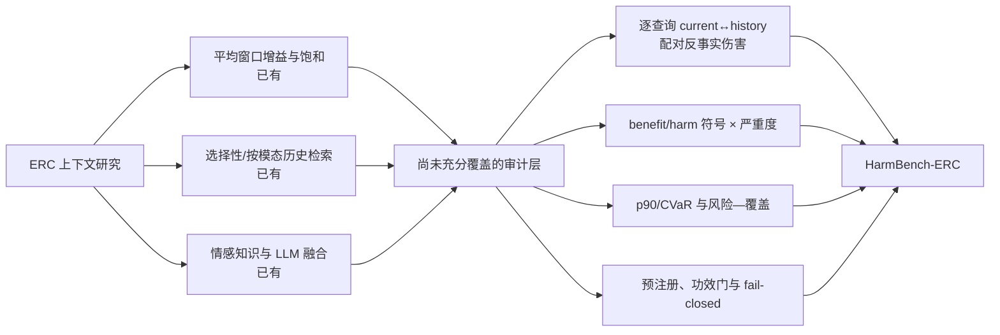

# CARMA-Affect 新协议候选与决策日志

日期：2026-08-09

状态：独立构思、定向文献核查与本地数据可行性门已完成；HarmBench-ERC 路线 provisional GO；尚未授权任何 sealed outcome

## 1. 焦点问题与边界

**焦点问题。** 在对话情感识别中，加入人物历史何时会伤害当前预测；这种伤害能否被跨模型、跨模态、跨数据集地稳定测量，并在不偷看未来话语或确认标签的前提下形成可审计的风险评估协议？

**目的。** 选择一个即使新控制器继续失败也能产生可投稿知识增量的路线，并在 MELD/EmotionTalk official test 一次性评估前冻结任务、基线、指标、统计和代码。

**真实约束。** N2 已在两个 model-selection 角色失败；这些结果不得回流后在同一角色重跑。EmotionTalk/MELD test、train calibration/internal-holdout 仍封存。CPED、M3ED、IEMOCAP 尚无许可闭环且本地无可用官方数据。受限真实文本、音频、视频不得发送到外部 GPT 服务。

**范围外。** 不再做 N2 Repair 4；不以未校正的多次试验挑选显著结果；不把模型损失差解释为真实心理因果效应；不因 test 尚未打开就宣称方法或 benchmark 已确认。

## 2. 独立候选（文献检索前）

以下均为 **idea**，不是发现。来源为本项目现有失败证据后的 AI-assisted 独立构思；尚未用文献新颖性检索筛选。

### I1：HarmBench-ERC——历史负迁移诊断 benchmark

**Idea。** 把研究对象从“某个选择器是否成功”改为“常见 ERC 模型在加入不同历史策略后产生多少逐查询伤害、尾部风险和群体异质性”。统一输出 current-only、all-history、recency、speaker-history、similarity retrieval 和 learned selector 的配对反事实。

**Assumption。** 平均 Macro-F1 会掩盖一部分查询的显著概率伤害；这一现象不仅属于一个冻结模型。

**Prediction。** 至少两类模型、两个数据集会复现非平凡 history-harm rate 和正的 p90/CVaR regret；历史长度、说话人切换、情感转折和模态缺失会系统改变风险。

**Disconfirming evidence。** 在足够强且校准后的多类模型上，history-harm 接近随机噪声、尾部区间包含可忽略区间，或所有模式只由单一实现错误解释。

### I2：Sign×Severity selective-context controller

**Idea。** 分开预测伤害发生概率与条件严重度，再在固定 coverage 下优化 mean、harm rate 与 CVaR 的联合约束；控制器只能在开发角色拟合，test 阈值一次冻结。

**Assumption。** 旧 mean/q90 与 N2 失败的主要原因之一是把伤害符号、严重度和集合交互压缩成单目标。

**Prediction。** 相比 harm-classifier、mean-risk、q90 和 recency，联合控制器在相同 coverage 下同时降低 mean regret、harm rate 与 CVaR，且不伤害 Macro-F1。

**Disconfirming evidence。** 经过独立校准后仍退化为全拒绝，或任一风险改善都以 Macro-F1/accuracy 明显下降为代价。

### I3：Affect-domain frozen encoder baseline

**Idea。** 用冻结的情感领域文本模型产生当前/历史表示，替代通用 TF-IDF/SVD，并与相同信息量、相同分类头的通用编码器公平比较；它是强基线/机制对照，不自动作为论文核心创新。

**Assumption。** 情感领域表示可提高情感转折、极性不一致和说话人状态变化的可辨识性。

**Prediction。** 在不增加未来信息的条件下提高 current/full base 的 Macro-F1 或历史伤害预测 AUC/排序相关，并且增量跨数据集方向一致。

**Disconfirming evidence。** 增量只出现在一个已观察开发角色、对强编码器消失，或主要来自参数量/预训练数据差异。

### I4：GPT/LLM 冻结文本审稿基线

**Idea。** 在许可、DPA/ZDR、成本和固定 prompt/model snapshot 全部满足时，把 GPT/LLM 仅作为预定义的 current-only 与 bounded-history 文本基线；当前先用 synthetic fixture 验证缓存、重试、时间遮蔽和零标签合同。

**Assumption。** LLM 可能提供更强语义与情感常识，但其不透明版本、数据治理和 prompt 适应性会削弱确认性价值。

**Prediction。** 若未来合规运行，固定 LLM 在文本任务上可能提高平均分类指标，但仍会出现可测的 history-harm；benchmark 应能审计这种风险。

**Disconfirming evidence。** 无法冻结模型版本/提示、数据不能合法外传、成本阻止五 seed/重复性，或等信息本地情感模型已经匹配其表现。

## 3. 预先评价标准

文献检索前先固定以下标准，按 1（弱）到 5（强）评分并保留不确定范围：

| 标准 | 权重 | 方向与最低门 |
|---|---:|---|
| 可区分的信息增益 | 0.25 | 必须有明确反证条件；零结果仍能缩小问题空间 |
| 相对已知工作的原创空间 | 0.20 | 检索后至少保留一个非措辞性的任务/指标/协议差异 |
| 确认性有效性 | 0.20 | 能在未观察 official test 或新合法数据上一次性检验 |
| 本地计算与数据可行性 | 0.15 | 8GB GPU/现有缓存可执行；不依赖未获许可数据 |
| 统计与复现强度 | 0.10 | cluster-aware、效应量/CI、强基线、完整失败报告 |
| 治理与发布安全 | 0.10 | 不外传受限数据，公开产物 aggregate-only |

任何候选若需要修改已冻结 N2 后重看同一 selection、读取未授权 test、或上传受限材料到外部服务，直接 veto，不参与加权平均。

## 4. 文献核查方法与边界

本轮是用于路线决策的 **定向 scoping review**，不是声称穷尽全部数据库的 PRISMA 系统综述。检索日期为 2026-08-09；检索源包括 OpenAlex、Crossref、arXiv、ACL Anthology、AAAI、IEEE、Elsevier 落地页及论文官方 GitHub。关键词族覆盖：

- `emotion recognition in conversation` × `history harm / context hurts / negative transfer`；
- `selective context / memory retrieval / marginal utility / regret / context saturation`；
- `CVaR / tail risk / fail-closed / selective prediction`；
- `GPT / LLM / emotion knowledge / multimodal` × `MELD / IEMOCAP / EmoryNLP / CPED / M3ED`。

纳入标准是直接处理 ERC 历史、选择性上下文、情感知识/理论或 LLM 多模态基线，且能在原论文、DOI、arXiv/ACL 页面或官方代码中核验。仅标题相似、无法核验摘要/正文、非 ERC 的通用风险论文不作为“已完成本任务”的证据。对 2026 年预印本单独标注，不能与已同行评审论文同强度解释。

本轮未保存可形成 PRISMA 流程的完整命中/排除计数，也未覆盖 Scopus、Web of Science 与 Google Scholar 全量索引。因此只能写“在本轮有边界检索中未发现直接同类”，不能写“绝对无人提出”。

引用复核：文中的显式 DOI 通过 Crossref 元数据核验；arXiv/ACL Anthology 主链接逐一跟随重定向检查。完整 DOI 数、失败数、访问日期、端点与链接状态见 [`11_新协议候选与决策日志_2026-08-09_citation_report.json`](11_新协议候选与决策日志_2026-08-09_citation_report.json)。链接可访问只证明书目信息/页面存在，不替代对方法和结果的人工全文判断。

## 5. 主题综合：哪些已经做过，哪里仍有缺口

| 主题 | 最接近工作与可核查链接 | 对本项目的约束 |
|---|---|---|
| 平均上下文增益与饱和 | *Causal Emotion Recognition in Conversation: Context Saturation and Discourse-Marker Evidence*（2026，arXiv:2601.00181，[论文](https://arxiv.org/abs/2601.00181)，[代码](https://github.com/philhelenina/causal-erc-context-saturation)） | 已说明历史贡献与窗口饱和；不能把“上下文并非越多越好”作为首创。其全文未报告逐查询 regret、CVaR、negative transfer 或 fail-closed benchmark |
| 按模态选择历史 | *BrainyHGNN*（2025，IEEE TCSVT，[DOI](https://doi.org/10.1109/TCSVT.2025.3572226)） | Dynamic Memory Selector 与跨模态交互对 I3/老师第三点构成高重叠；本项目不能以“按模态检索相关历史”单独主张新颖 |
| 过去/未来双路上下文 | *PFA-ERC*（2024，Findings of EMNLP，[DOI](https://doi.org/10.18653/v1/2024.findings-emnlp.950)）；AGHMN（2020，AAAI，[DOI](https://doi.org/10.1609/aaai.v34i05.6309)）；早期 BLSTM（2010，Interspeech，[DOI](https://doi.org/10.21437/Interspeech.2010-646)） | “双向上下文编码”已有长期先例。CARMA 的双向只能定义为两个反事实方向/边际效用，不能混同 BiLSTM 或过去+未来编码 |
| 过去/未来 × 心理知识 | SKAIG：*Past, Present, and Future: Conversational Emotion Recognition through Structural Modeling of Psychological Knowledge*（2021，Findings of EMNLP，[DOI](https://doi.org/10.18653/v1/2021.findings-emnlp.104)） | 过去上下文推断 action、未来上下文推断 intention；它同时覆盖老师前两点，是“方向性上下文 + 情感/心理理论”的直接联合先例 |
| 情感知识/理论选择 | SKSEC（online 2022；正式卷期 2023，IEEE TAFFC，[DOI](https://doi.org/10.1109/TAFFC.2022.3223517)） | sentiment、current/context emotion 与维度情感模型已经用于知识筛选；情感理论模块只能是受控机制，不足以单独支撑创新 |
| GPT 生成知识 | *An Empirical Study on Multiple Knowledge from ChatGPT for ERC*（2023，Findings of EMNLP，[DOI](https://doi.org/10.18653/v1/2023.findings-emnlp.813)） | ChatGPT 作共指/主题/情绪原因等外部知识生成器已有明确先例；它不等同于一般伪标签 teacher 证据 |
| LLM 教师/伪标签 | *LLM Supervised Pre-training for Multimodal Emotion Recognition in Conversations*（2025，ICASSP，[DOI](https://doi.org/10.1109/ICASSP49660.2025.10889998)，[arXiv](https://arxiv.org/abs/2501.11468)） | LLM 为未标注语音转录生成伪标签再训练文本/语音模型；“LLM 作教师”已有直接先例，但摘要不能支持“特定 GPT 教师”表述 |
| 指令化/领域化 LLM | InstructERC（2023，[arXiv](https://arxiv.org/abs/2309.11911)，[代码](https://github.com/LIN-SHANG/InstructERC)）；DialogueLLM（2025，*Neural Networks*，[DOI](https://doi.org/10.1016/j.neunet.2025.107901)） | 情感标签体系、speaker/future 辅助任务和情感知识微调均已有强工作 |
| LLM 多模态情感 | SpeechCueLLM（2025，Findings of NAACL，[DOI](https://doi.org/10.18653/v1/2025.findings-naacl.117)）；MSE-Adapter（2025，AAAI，[DOI](https://doi.org/10.1609/aaai.v39i24.34755)）；Emotion-LLaMA（2024，NeurIPS，[DOI](https://doi.org/10.52202/079017-3518)，[arXiv](https://arxiv.org/abs/2406.11161)） | 声学语言化、轻量多模态 adapter 和情感专用 LLM 已有成熟路线；Emotion-LLaMA 主评测不是标准 MELD/IEMOCAP ERC，不能直接比较任务数字。未来 GPT/LLM 只能作冻结强基线或风险审计对象 |
| 长对话因果提示 LLM | *Causal-ERC: A Multimodal Framework with Causal Prompting for Emotion Recognition in Conversations with Large Language Models*（2026，AAAI，[DOI](https://doi.org/10.1609/aaai.v40i37.40402)） | 各模态先形成 context representation，再注入 LLM，并按 utterance causal type 调整提示；这是对“各模态分别处理自身历史后交互”和直接 LLM 路线最强的最新重叠之一，且不同于上面的 context-saturation 预印本 |

### 研究缺口图

有边界检索中，`history harm`、`context hurts`、`CVaR + ERC`、`fail-closed + ERC` 未找到直接同类原论文。当前检索只支持一个**候选贡献空间**，尚未确立 novelty：在同一冻结预测器上把平均上下文增益改写为逐查询配对伤害分布，分离符号与严重度，并以尾部风险、强历史基线和 fail-closed 协议跨数据集审计。CVaR、selective prediction 与 fail-closed 在通用机器学习中均不是新概念，最终贡献必须来自 ERC 特定问题定义、配对设计与实证，而不是机械拼接指标。

## 6. 数据可行性与 veto

- 本地没有许可闭环且可立即用作新确认集的 CPED、M3ED 或 IEMOCAP。第三方 IEMOCAP `.pkl` 不具备 USC 官方许可/谱系，列入正式输入 denylist。
- EmotionTalk official test 1,929 条和 MELD official test 2,610 条仍未观察，但 N2 层未授权读取。只有在新 protocol ID、代码、模型、指标、功效和公开模板完全冻结后，才可由独立一次性 stage 打开。
- CPED 规模最有利于小效应研究，但需要先留档 LUGE 条款和正式文件清单；M3ED 需作者/官方澄清视觉版权与许可证；IEMOCAP 需机构申请 USC release。
- 真实受限数据外部 GPT 路线继续 veto。synthetic adapter 可验证工程合同，但不能作为真实实验。

## 7. 透明评分与决策

以下分数是路线决策辅助，不是科学事实；按第 3 节冻结权重计算，原创空间的不确定性最大。

| 候选 | 信息增益 | 原创空间 | 确认有效性 | 可行性 | 统计复现 | 治理安全 | 加权分 | 决策 |
|---|---:|---:|---:|---:|---:|---:|---:|---|
| I1 HarmBench-ERC | 5 | 3（范围 2–4） | 4 | 5 | 5 | 5 | 4.40 | **provisional GO**；原创性压力最大 |
| I2 Sign×Severity controller | 4 | 3 | 3 | 3 | 4 | 5 | 3.55 | 仅作预声明 challenge baseline；不得回看 N2 selection 调参 |
| I3 情感领域冻结编码器 | 3 | 2 | 4 | 4 | 4 | 5 | 3.45 | 强基线/机制对照，不作核心首创 |
| I4 GPT/LLM 真实数据基线 | 3 | 1 | 1 | 1 | 2 | 1 | 1.60 | 当前 NO-GO；等许可、DPA/ZDR、凭据和快照均齐备再复审 |

**Decision。** 选择 I1 作为新主路线，暂定协议名 `harmbench_erc_v1`。I2/I3 只能服务于 benchmark 的强基线覆盖，不能把新方法包装成已经成功。I4 保留 synthetic-only 合同。

**Revisit trigger。** 若单篇工作或相互衔接的文献群已经覆盖核心诊断对象与主要指标，或剩余差异只是一组通用风险指标的机械拼接，或 official test 的 prospective sensitivity 不足，则重新评估核心贡献并优先扩展数据集，而不是改写 novelty。

## 8. 下一步冻结顺序

1. 实现只接受预测/角色/集群身份而不接受原始媒体的 `harmbench_erc_v1` 核心 evaluator，并用 synthetic fixtures 完整测试。
2. 在已观察 open roles 上只做 benchmark 工程验证与 descriptive/exploratory 多模型审计，登记全部候选与失败。
3. 冻结模型 roster、历史策略、损失定义、主要指标、cluster 层级、bootstrap/randomization、multiplicity 和 prospective sensitivity。
4. 先生成 official test 的 outcome-free feature/prediction artifact；在来源、未来遮蔽和 write-once 验签通过前不得打开标签。
5. 由单独 evaluator 一次性打开 MELD/EmotionTalk test label sidecar，只发布 aggregate-only 结果；若任何预注册完整性门失败，fail closed 且不重跑同一 test。

## 9. 原 provisional 判断（保留审计轨迹）

- I1 是当前最可逆、负结果价值最高的候选，但是否具有顶会原创性取决于文献核查以及能否扩展到多模型/多历史策略/两个 untouched tests。
- I2 只允许作为 I1 benchmark 中的预声明挑战基线；不能在 N2 selection 上继续调参。
- I3 是落实“情感领域模型/理论”的最可行强对照，应先核查模型许可、训练语种和参数公平性。
- I4 当前因数据治理与凭据缺失为真实数据 NO-GO；synthetic adapter 合同可以保留，但不构成实验结果。

本节记录文献核查前的判断。最终选择已更新为第 7 节的 `harmbench_erc_v1` provisional GO；prospective sensitivity 和 official-test authorization 仍未完成。

## 10. HarmBench-ERC v2 候选协议（2026-08-09 增补）

本节只说明新建的 `harmbench_erc_v2_candidate`，不改写、不替代已发布的
`harmbench_erc_v1` S0 合同或既有公开产物。v1 保持 legacy；v2 当前仍是
`S2_candidate_no_official_test_authority`，真实训练、selection outcome、official-test
特征、预测、标签与评估均未获授权，prospective sensitivity 仍为 `pending`。

v2 冻结三类模型：`hb_linear_pool_v1`、`hb_deepsets_pool_v1`、
`hb_causal_gru_v1`。共同锚点是 `independent_current_only`；五个历史策略按固定
顺序为 `dialogue_all_past`、`same_speaker_all_past`、`recent_k3`、
`similarity_top3`、`modality_balanced_top3`。每个策略均冻结候选池、严格过去、
top-k、排序与并列规则、零向量规则、模态顺序、重复跳过、规范输出顺序和空集
回退，并由规则版本及 SHA-256 写入每个 context receipt。调用方不能在运行时传入
自由 top-k、排序、候选范围、eligibility 或 fallback。

共同 eligibility 是 outcome-free 的 `E_dialogue`：在同一来源角色、同一现场派生
partition、同一独立对话组中，至少存在一条 `candidate.turn_id < query.turn_id` 的
候选；它不要求同一 speaker，也不依赖任何策略是否实际输出非空 context。
`strategy_context_nonempty` 只作策略支持度描述，`E_speaker` 只作次要条件分析，二者
均不得替代主分析的 `E_dialogue`。主对比固定为同一 dataset/model/seed/fold/query 下
的 `same_speaker_all_past` 对 matching current-only；`dialogue_all_past` 是 scope
control，其余三个历史策略均为 secondary。

最终 primary Holm family 已明确列出三模型乘以 `{Macro-F1, mean-regret}` 的六个
假设；三模型是预声明的 co-primary（`all_three_predeclared_co_primary_no_winner`），
禁止 any-of 或看到结果后改成单一赢家；其实现状态仍是 S2 candidate。evaluator 同时冻结 15 个
等宽区间的 top-label ECE（边界按 `[i/15,(i+1)/15)`，末箱包含 1.0；argmax 并列取
冻结类别序中的第一个；空 bin 忽略，非空 bin 按 query count/N 加权）、`E_dialogue` 严格过去深度
`1 / 2–3 / 4–7 / >=8` 的 outcome-free 分层。深度唯一取同 model family、同 query 的
`dialogue_all_past.context_count`，并要求 5 seeds × 5 folds 的 25 个值完全一致，否则在
读取 outcome 前按协议错误 fail closed；少于两个独立 cluster 时记为不可估，
不得事后换层）、whole-cluster paired randomization（cluster 阈值 20 以内精确枚举；
否则 100000 次、seed 20260811）、alpha=0.90 的 fractional-boundary CVaR、0.00/0.05
nats harm 阈值、最小实际效应与逐 model×dataset no-harm gate。sign×severity 另按
`regret < -0.05`、`-0.05 <= regret < 0`、`regret == 0`（含 fallback）、
`0 < regret <= 0.05`、`regret > 0.05` 五个互斥顺序箱输出全部 count/fraction，不得挑箱。
所有已观察 selection
outcome 结果永久标记为 exploratory，不得进入 primary family、改变 roster/阈值/
eligibility/分层或授权重跑。

no-harm CI 的来源也已冻结：whole-cluster bootstrap 使用 10000 次、seed 20260810；
五个 training seed 有放回抽样，各数据集内 whole independent-group cluster 有放回抽样；
同一 replicate 的 draws 对全部模型、策略和指标共享，candidate/anchor 严格配对；双数据集
点估计和同编号 replicate 均作等权平均；CI 为 percentile `[2.5,97.5]`，有限 replicate
比例至少 0.95。调用方不得覆盖参数，看到 outcome 后不得改 bootstrap。

evaluator 必须一次装载精确 36 个 exploratory selection prediction artifacts：dataset ID
严格为 `EmotionTalk`、`MELD`，各 18 个；不得用未来 confirmatory 的
`EmotionTalk_official_test`、`MELD_official_test` 身份代替。三模型各有
一个 current anchor 和五个历史策略，缺项、重复和额外项均失败。现场还要复验同数据集
query/group/class/seed/E_dialogue 对齐、history nonempty 是 `E_dialogue` 子集、current 的
25 个 seed×fold context count 全零但携带真实 `E_dialogue`、dialogue-all nonempty 等于
`E_dialogue`，以及 dialogue-all depth 跨模型一致。

历史策略 context 为空时，必须在 dataset/model/seed/fold/query 层逐元素复制唯一 matching
current-fold anchor 概率；不得采用 history checkpoint 的空集合 raw 输出，fallback 后
regret 必须 canonical exact 0。之后才对精确五折概率作算术均值，再按每个 seed/query
计算 NLL regret、argmax 等行指标；禁止先算 fold 指标或先跨 seed 平均概率。

一次性 evaluator 的不可逆状态顺序固定为 `analysis_frozen` → `predictions_verified` →
`prelabel_bundle_write_once_fsync` → `attempt_marker_write_once_fsync` →
`label_capability_created` → `each_label_sidecar_single_handle_single_deserialization` →
`in_memory_row_metrics` → `aggregate_only_publication` → `terminal_exploratory`。attempt marker
必须早于 label path resolve/stat/hash/open；任何 crash 或 partial output 都进入终态，
不得静默重跑。

`learned_selector_v1` 和 `coverage_matched_recency_v1` 不属于 context roster，只能在
独立 `policy_artifact_contract` 下、通过尚未实现的 typed receipt 注册；它们不得定义
confirmatory eligibility，也不构成打开 official test 的授权。
