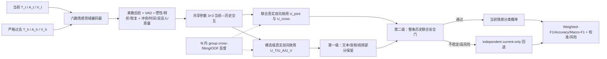

# N3 候选方案：老师要求对照与冻结协议

> 状态：PROVISIONAL（结构已按老师要求定义；编码器许可、IEMOCAP 可行性与最终 protocol SHA 尚待审计完成）
> 模式：synthesize
> 最高研究依据：用户提供的四条连贯研究要求及仓库内冻结协议
> 证据截止：2026-08-09
> 结论边界：本文是预注册/实现合同，不是性能结果，也不授权读取任何封存标签。

## 1. 一句话研究命题

利用情感领域模型分别表示当前与历史的文本、音频和视频，通过共享参数的 3×3 跨模态交互，以及模态级、联合级真实双向边际效用控制，只选择能够稳定提高当前情感分类性能、且历史伤害风险可接受的信息。

## 2. 老师四条要求—N2—缺口—N3 对照

| 老师要求 | 当前 N2 已实现 | 关键缺口 | N3 修改方案 | 决定性验证 |
|---|---|---|---|---|
| 1. 单向边际效用改为双向边际效用 | N2/相关原型已有不同集合的候选历史级 forward-addition 与 backward-deletion OOF 目标，并证明不能用同一集合边制造符号相反的伪双向；但 N2 的 backward 采用“保留有益为正”符号 | 主要停留在整条候选/联合层；没有文本、音频、视频逐模态的受控加入/删除归因，也没有联合效用无法由单模态解释的协同/冲突项；N3 还须按老师原式统一为“删除有益/保留有害为正” | 对每条候选分别学习 `U_T/U_A/U_V=(M_forward,M_backward-risk)`，每次只改变对应模态；另学习 `U_joint`，并显式计算逐方向 `U_cross=U_joint-(U_T+U_A+U_V)`；旧 N2 backward 进入 N3 时必须显式乘 `-1`，不得静默混用 | 双向模型相对单向模型提高真实分类指标并降低历史伤害率；去模态级效用或联合效用后下降 |
| 2. 加入情感领域模型/理论 | N2 使用固定 VAD 表、VAD 辅助损失和轻量 3×3 关系；通用特征包括 TF-IDF/SVD、通用 WavLM/DINOv2 资产 | 固定 VAD 与通用编码器不能替代情感领域表示；离散情绪后验、惯性、转折、恢复、跨模态冲突、质量等变量未完整进入模型与门控 | 文本优先情感微调 RoBERTa/DeBERTa；音频优先 emotion2vec 或 SER-WavLM/wav2vec2；视频优先 AffectNet/FERPlus/AU 模型。离散后验、VAD、惯性、转折、恢复、冲突、时间、说话人和质量进入理论特征层、交互条件和门控 | “通用三模态编码器 vs 情感领域编码器”公平比较；去 VAD、转折、冲突及完整情感层消融；真实 Weighted-F1/Accuracy 增益 |
| 3. 当前/历史的文本、音频、视频分别或交叉处理 | N2 有严格过去的 3×3 当前—历史关系摘要与容量匹配消融 | 六路并非由六个明确的情感编码接口独立保持；九组关系是轻量摘要，不支持候选模态的部分保留和模态级归因 | 保留 `T_t/A_t/V_t/T_h/A_h/V_h` 六路；共享投影后计算 T–T/T–A/T–V、A–T/A–A/A–V、V–T/V–A/V–V；第一层按模态门控，第二层按整条历史门控 | 同模态三路 vs 完整 3×3；完整 3×3 vs 参数量/计算匹配 control；部分模态保留诊断 |
| 4. 证明在情感领域任务上有效 | N2 在 MELD/EmotionTalk 已观察 model-selection 上只形成历史负迁移与失败诊断；joint gate 为 FAIL，不能授权确认结论 | 伤害预测 AUC、效用 RMSE 或工程测试不能证明情感分类变好；已观察 selection 不能继续调参后包装为确认性成功 | 主任务始终为情感分类；MELD 主指标固定 Weighted-F1，并同时报告 Accuracy、Macro-F1、NLL、Brier、ECE、伤害率、CVaR 与风险—覆盖；新结论只来自冻结后的未观察角色/预注册外部确认集 | 完整成功门必须合取通过；IEMOCAP 冻结后外部确认，无论正负均报告；禁止模型选择 |

## 3. Task Contract

- 研究对象与分析单位：一条当前情感话语 `q_t` 及其严格过去候选历史话语 `h<t`；统计重采样单位为预注册的独立对话/session/说话人组，而不是把 utterance 当独立样本。
- 推理时可用输入：当前 `T_t/A_t/V_t`；严格过去的 `T_h/A_h/V_h`；时间距离；同说话人标志；模态存在性与质量。不得使用当前/未来评估标签、未来话语或跨切分人物信息。
- 输出：当前话语的情绪类别概率、最终类别、置信度、每条候选的三个模态门和一个联合门、必要时的 current-only 回退决定。
- 主目标：降低真实情感分类损失并提高预注册分类指标；效用、VAD 和校准仅作辅助。
- 最强比较：independent current-only、all-history、recent-k、similarity retrieval、参数/计算匹配的通用三模态模型和同容量 N3 消融。
- 明确排除：不得把模型相对效用解释为心理因果效应；不得把工程合同通过、效用 AUC 或伤害率单独包装成方法成功。
- 成功标准：第 11 节所有合取门同时满足；缺一项即不宣称 N3 正向成功。

## 4. 核心假设与反证条件

核心假设：因为多模态历史的作用会随情感状态、模态可靠性、加入背景和删除背景而改变，把情感领域六路表示、共享 3×3 关系和模态/联合真实双向效用联合用于两级门控，应当比 current-only 和最强历史基线更准确，同时比单向效用更少引入历史伤害。

最强反证：在公平容量、相同输入、相同训练预算、至少 5 个种子和冻结统计下，完整 N3 不能提高真实情感分类，或其增益在去掉情感编码器、模态级双向效用、联合双向效用或 3×3 后不下降，则核心机制主张被削弱/拒绝；即使效用 AUC 提高也不能挽救该结论。

## 5. 六路情感建模与变量进入位置

| 变量/信号 | 计算方式（不得使用评估标签） | 进入层 | 参与门控 |
|---|---|---|---|
| 六路嵌入 | 情感领域编码器分别产生 `z_t^T,z_t^A,z_t^V,z_h^T,z_h^A,z_h^V`；通用编码器只作基线 | 模态投影层和 3×3 交互层 | 是，作为模态/联合门主输入 |
| 离散情绪后验 | 各模态冻结或 fit-only 微调的情绪头输出类别概率；跨数据集类序映射预注册 | 情感理论表征层 | 是，计算一致/冲突和候选状态 |
| VAD | 优先用编码器 VAD 头；否则对 fit-only 后验按冻结情绪原型求期望，不读取当前评估标签 | 理论层、辅助 `L_VAD` | 是，当前—历史差、方向和置信度 |
| 情感惯性 | 同一说话人的相邻/候选情绪后验相似度与 VAD 距离，经冻结时间衰减 | 理论层 | 是，描述历史延续性 |
| 情感转折 | 当前与上一严格过去状态的 JSD、VAD 有符号差及离散后验 argmax 变化 | 理论层 | 是，降低不适配旧历史的权重 |
| 情感恢复 | 历史极值后向该说话人 fit-only 基线状态回归的 VAD 方向/幅度；不可获得时显式 mask | 理论层 | 是，区分暂态与恢复段 |
| 跨模态情绪冲突 | 同一时刻 T/A/V 后验的两两 JSD、VAD 方向冲突和置信度加权分歧 | 理论层与 3×3 条件层 | 是，支持只保留可靠模态 |
| 时间距离 | 当前与候选 turn/time 差，经预注册 log/clip/decay | 门控上下文 | 是 |
| 说话人身份 | `same_speaker` 二值标志；IEMOCAP 等外部确认禁止跨 session/说话人泄漏 | 门控上下文 | 是 |
| 模态质量 | 文本缺失/长度，音频有效时长/能量/SNR proxy，视频人脸可见率/跟踪置信度；缺失值带 mask | 编码后质量层 | 是，直接调制模态门 |

所有连续理论变量只用 fit 统计量标准化；validation/test 的标签和总体分布不得用于拟合、截断或阈值选择。

## 6. 共享参数的 3×3 当前—历史交互

九组关系固定为：

| 当前 \ 历史 | 文本 `T_h` | 音频 `A_h` | 视频 `V_h` |
|---|---|---|---|
| 文本 `T_t` | T–T | T–A | T–V |
| 音频 `A_t` | A–T | A–A | A–V |
| 视频 `V_t` | V–T | V–A | V–V |

六路先投影到共同维度。九组不使用九套独立大模型；采用共享的低秩双线性交互或共享 cross-attention 主体，只加入当前模态/历史模态类型嵌入和小型低秩适配。每个关系同时接收情绪后验/VAD 差、冲突、时间、说话人和质量条件。容量 control 必须匹配可训练参数、输入信息、训练步数和主干编码成本。

## 7. 真实模态级与联合级双向边际效用

令 `ell(q;H)` 为冻结 base emotion classifier 在历史集合/多模态状态 `H` 下对当前真实类别的 OOF 交叉熵；所有 `ell` 仅在 fit 内 group cross-fitting 产生。

对候选历史 `h` 的模态 `m∈{T,A,V}`，前向背景 `S_m` 不含 `h^m`，后向完整背景 `R_m` 含 `h^m`，并冻结每一对比较中除 `h^m` 外的全部候选模态和背景历史：

```text
M_m_forward  = ell(q; S_m)          - ell(q; S_m + h^m)
M_m_backward = ell(q; R_m)          - ell(q; R_m - h^m)
U_m = (M_m_forward, M_m_backward)
```

`R_m` 必须是比 `S_m+h^m` 更完整、由预注册采样器得到的不同集合状态；禁止令 `R_m=S_m+h^m` 后把同一差值改符号冒充双向效用。符号严格按老师原式：`M_forward>0` 表示加入有益；`M_backward>0` 表示删除后更好、即保留该模态有害。N2 既有 benefit-positive backward 定义为 `ell(R-h)-ell(R)`，与 N3 正好相反；旧结果保持原定义，任何复用必须显式取负并登记 provenance。

联合效用同时改变候选的三种模态：

```text
M_joint_forward  = ell(q; S)            - ell(q; S + {h^T,h^A,h^V})
M_joint_backward = ell(q; R)            - ell(q; R - {h^T,h^A,h^V})
U_joint = (M_joint_forward, M_joint_backward)
U_cross = U_joint - (U_T + U_A + U_V)   # forward/backward 分量分别计算
```

`U_cross` 是描述非可加协同/冲突的残差，不要求效用严格可加。最终选择以 `U_joint` 为主，`U_T/U_A/U_V` 用于解释、模态门控和部分模态保留。

## 8. 两级门控与 current-only 回退

1. 模态级门控：为 `h^T/h^A/h^V` 分别输出概率/风险界；依据该模态的双向效用、质量和跨模态冲突，可保留一条历史的部分可靠模态。候选门的必要条件是 `LCB(M_m_forward)>tau_forward` 且 `UCB(M_m_backward)<=tau_backward-risk`。
2. 联合门控：在部分保留后估计 `U_joint`、`U_cross`、不确定性和校准风险。只有联合前向收益下界为正、联合后向删除风险上界不为正且总体风险上界低于冻结阈值时才启用历史。
3. 失败策略：不稳定、冲突过大、模态缺失或风险不可接受时，依次降权、仅保留通过的模态；若联合门仍不通过，则逐元素回退 independent current-only，不能使用另一个 history checkpoint 的空历史输出代替。

## 9. 训练目标

```text
L = L_emotion
  + lambda_T   L_text_utility
  + lambda_A   L_audio_utility
  + lambda_V   L_video_utility
  + lambda_J   L_joint_utility
  + lambda_C   L_cross_consistency
  + lambda_VAD L_VAD
  + lambda_cal L_calibration
```

`L_emotion` 始终是主任务；任何辅助项的权重、warm-up、停止规则和阈值必须在解封未观察角色前冻结。效用监督只准来自 fit 内 group cross-fitting/OOF；模型输入不得包含当前评估角色标签或由其计算的特征。

## 10. 最低基线和消融（精确 15 项）

1. Current-only；
2. Full/all-history；
3. Recent-k、similarity retrieval 等强历史基线；
4. 通用三模态编码器；
5. 情感领域编码器；
6. 仅同模态 T–T/A–A/V–V；
7. 完整 3×3；
8. 单向边际效用；
9. 文本/音频/视频模态级双向效用；
10. 联合双向效用；
11. 去 VAD；
12. 去情感转折；
13. 去跨模态情绪冲突；
14. 完整 N3；
15. 参数量和计算预算匹配的 capacity control。

同一实验表还必须报告可训练参数量、总编码器参数量、FLOPs/近似计算、峰值显存、训练时长和输入可用信息，防止把额外容量或额外数据误写为机制增益。

## 11. 指标与合取成功门

MELD 主要指标固定为 Weighted-F1；同时报告 Macro-F1、Accuracy、NLL、Brier、ECE、历史负迁移率、CVaR 和风险—覆盖曲线。

完整 N3 必须同时满足：

1. Accuracy 高于 independent current-only；
2. Weighted-F1 高于最强历史基线；
3. Macro-F1 不能明显下降；
4. 对话/session/说话人组级配对 95% CI 支持提升；
5. 至少 5 个随机种子方向基本一致；
6. 双向效用的历史伤害率低于单向效用；
7. 去掉情感编码器、双向效用、模态级效用或 3×3 后性能下降；
8. 提升来自真实情感分类，而不只是效用 AUC、RMSE 或伤害率改善。

统计合同须在未观察标签前冻结：重采样单位、replicate 数、seed、配对方式、有限 replicate 门、区间端点、多个主比较的校正、实际最小效应、no-harm 界、5-seed 汇总和公开 aggregate-only schema均不得事后修改。

## 12. 数据角色与 IEMOCAP 外部确认预注册

- 已观察的 MELD/EmotionTalk model-selection 结果永久只作探索性问题证据，不得继续调参后宣称确认成功。
- IEMOCAP 预注册为 N3 的第三个独立外部确认数据集：不得用于编码器/模型/阈值/标签映射选择，不得用于 early stopping 或任何形式的调参；只在 N3 protocol SHA、源码 snapshot、权重 SHA、超参数、效用阈值、统计合同和公开模板全部冻结后运行；正负结果均发布。
- IEMOCAP 必须采用 session 级说话人隔离，任何同一 speaker/session 不得跨 fit 与评估；具体 LOSO/held-session 映射及四类/六类标签协议须在首次标签读取前固定。
- IEMOCAP 只有在官方授权有效、三模态原始数据可合法使用、严格过去上下文可构造、当前/历史六路均有可审计覆盖、标签协议不依赖结果时才可运行。
- 若 IEMOCAP 因授权或预声明六路可行性门失败，替代顺序固定为 CPED 后 M3ED。只允许记录 `license_or_access_failure`、`required_modality_unavailable`、`speaker_isolation_impossible` 或 `label_contract_impossible` 等预声明原因后顺序切换；禁止看到性能后切换。

## 13. Synthetic/fit-only 实现合同与停止条件

允许立即执行：

- 六路 shape/dtype/mask/row-alignment 合同；
- 9 组共享参数交互和参数量匹配测试；
- 真双向集合攻击测试（同一集合边必须 fail closed）；
- 模态级只改变一个模态的归因测试；
- `U_cross` 的方向、维度和非可加样例；
- current-only 精确回退；
- fit-only group OOF、组隔离、label/role denylist；
- 缺失模态、质量为零、乱序、未来历史、重复 speaker/session 的对抗测试；
- 配置 canonicalization、protocol SHA、write-once 结果和公开隐私 schema。

当前必须停止于：任何 MELD/EmotionTalk calibration、internal holdout、validation、official test；任何 IEMOCAP/CPED/M3ED 性能运行；任何真实受限数据上传 GPT/API；任何基于已观察 selection 的 N3 阈值或超参数选择。

## 14. 方法框架图草案



## 15. Claim—evidence matrix

| 待检验主张 | 必需比较 | 消融/诊断 | 反证结果 |
|---|---|---|---|
| 情感领域编码器提供任务相关增益 | 情感编码器 vs 信息/容量/预算匹配通用编码器 | 冻结主干 vs fit-only 微调；单模态质量分层 | 真实分类无提升或只来自额外容量/数据 |
| 真实双向优于单向 | 完整双向 vs forward-only | 同集合伪双向负对照；伤害率与校准 | 分类不提升、伤害率不降或方向不稳定 |
| 模态级效用支持可靠部分保留 | 联合-only vs 模态+联合 | 去 `U_T/U_A/U_V`；缺失/冲突模态压力 | 去掉后不下降，或门只学到缺失标志 |
| 完整 3×3 提供跨模态历史信息 | 同模态三路 vs 完整九路 | 去跨模态 6 路；capacity control | 完整模型优势被参数/计算匹配模型解释 |
| N3 改善真正情感分类 | 完整 N3 vs current-only 与最强历史基线 | 15 项完整表、至少 5 seeds、外部确认 | 只改善 utility AUC/伤害率但 Weighted-F1/Accuracy 不升 |

## 16. Readiness audit

| 维度 | 当前状态 | 说明 |
|---|---|---|
| 清晰度 | 4/5 | 任务、六路、效用和成功门已明确；最终数值超参数待冻结 |
| 定位 | 3/5 | N2 差距清楚；closest-work 和 checkpoint/许可仍在核验 |
| 新颖性 | 3/5 | 组合假设具体，但不能在完整文献审计前宣称首创 |
| 可行性 | 2/5 | 8GB 资源和三类情感编码器/IEMOCAP 六路许可仍是关键未知 |
| 可证伪性 | 5/5 | 合取成功门和组件级反证清楚 |
| 一致性 | 4/5 | 老师要求—组件—实验已闭环；最终 protocol pin 尚未生成 |

当前总体状态为 **PROVISIONAL**。最高杠杆下一动作：完成情感编码器与 IEMOCAP/CPED/M3ED 审计，然后把本文件转成 canonical JSON 配置并生成不可变 protocol SHA；在这之前不得解封任何未观察标签。
