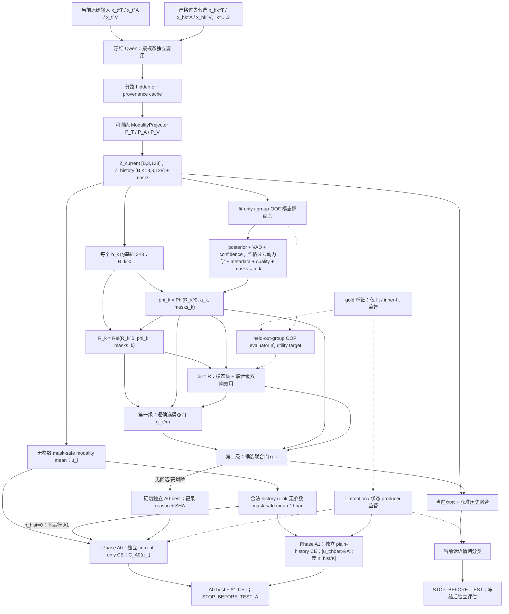

# N3 候选方案：老师要求对照与冻结协议（历史基础，已同步最新目标协议）

> **文档身份（务必先读）：**本文形成于 2026-08-09，是 N3 研究问题、双向效用和成功门的**历史设计基础**；正文已在 2026-08-13 按最新目标协议修正，以免旧符号和旧数据角色继续造成误读。它不是服务器操作单，也不表示目标链路已经实现或取得性能提升。
>
> **当前执行依据：**实际执行以 [最新执行基线](14_最新执行基线与GitHub旧方案差异_2026-08-13.md)、[MELD 已解压数据后续执行全流程](15_MELD_已解压数据后续执行全流程_2026-08-13.md) 和 [IEMOCAP 已解压数据后续执行全流程](16_IEMOCAP_已解压数据后续执行全流程_2026-08-13.md) 为准。本文与三份文件冲突时，以三份当前执行文档为准。
>
> **目标设计与当前代码不可混写：**本文第 3–10 节描述的是待实现的目标协议。当前仓库代码仍主要是“文本接入 Qwen、音频/视频使用 sidecar、synthetic trainer 验证合同”，尚未实现完整的三模态 `x→e→z`、逐候选 `K=3`、情感状态层、真实双向效用和两级门控链路。
>
> **结论边界：**本文是可证伪的设计/冻结合同，不是实验结果，不授权读取封存评估标签，也不支持“完整 N3 已有效”的表述。

## 0. 冻结术语、符号与阅读边界

最新主线必须区分三层表示；旧稿中用 `T_t/A_t/V_t/T_h/A_h/V_h` 同时指代原始媒体、编码器输出和 N3 输入的写法不再有效。

| 层级 | 冻结符号 | 定义 | 允许的下游用途 |
|---|---|---|---|
| 原始模态输入 | `x_i^m` | 话语 `i` 的原始文本、音频波形或视频片段，`m∈{T,A,V}` | 只由数据预处理器和冻结 Qwen producer 消费 |
| Qwen 隐藏表示 | `e_i^m=E_Qwen^m(x_i^m)` | 冻结 `Qwen3-Omni-30B-A3B-Instruct` 对每种模态独立调用所得 hidden；当前话语与每个历史候选均独立提取 | 分模态离线缓存，并保存 model/processor/revision/hash/shape/dtype/mask provenance |
| N3 投影表示 | `z_i^m=P_m(e_i^m)∈R^128` | 三个可训练且不共享参数的 `ModalityProjector P_T/P_A/P_V` 输出 | N3 情绪头、关系层、效用头、门控和分类器的实际输入 |

冻结的批接口为：

```text
Z_current = stack_m(z_t^m)                         # [B, 3, 128]
Z_history = stack_k,m(z_hk^m), K=3                # [B, K=3, 3, 128]
current_modality_mask                              # bool [B, 3]
history_mask                                       # bool [B, K=3]
history_modality_mask                              # bool [B, K=3, 3]
same_speaker                                       # bool [B, K=3]
```

全局候选槽位冻结为同一规则：先从同一对话中取严格早于 `t` 的最近 `K=3` 条合法话语，再按时间 **oldest→newest** 写入 `h_1,...,h_K`，因此 `h_K` 永远是最近的合法历史。若合法历史少于 `K`，固定使用**左侧 padding**：例如仅两条历史时槽位为 `[PAD,h_2,h_3]`，`history_mask=[0,1,1]`；padding 槽的 `history_modality_mask` 与 `same_speaker` 可存安全占位，但任何计算必须首先受 `history_mask=0` 屏蔽。不得因数据集、batch 或模型阶段改变 padding 侧，也不得复制样本补满 `K`。

`x` 不直接进入 N3，`e` 不是关系层的最终统一维度，`z` 才是真正的 N3 输入。RoBERTa/DeBERTa、emotion2vec/SER-WavLM、AffectNet/FER+/AU 等情感专用编码器仅作**替代表征 baseline**：在相同切分、预算、投影、N3 结构和评估合同下替换同模态 Qwen `e_i^m`。它们不是当前主模型额外叠加的情感理论层，也不是主模型中可随意“移除”的组件。

## 1. 一句话研究命题

先用冻结 Qwen 分模态、分候选产生可追溯表示，再以 fit-only/group-OOF 情绪状态和严格过去动力学条件化逐候选 3×3 关系、真实双向边际效用与两级门控，只融合对当前话语情感分类稳定有益且伤害风险可接受的历史模态；若条件不满足，则精确回退 current-only。

## 2. 老师四条要求—历史缺口—最新 N3 对照

| 老师要求 | 历史 N2/旧候选的基础 | 旧稿易误读或关键缺口 | 最新目标协议 | 决定性验证 |
|---|---|---|---|---|
| 1. 单向边际效用改为双向边际效用 | 已有 forward-addition、backward-deletion 和“同一集合边不能冒充双向”的诊断 | 主要停留在聚合历史/联合层，模态级归因不足；旧 backward 符号与最新风险口径相反 | 对每个 `h_k` 分别学习 `U_k^T/U_k^A/U_k^V` 与 `U_k^joint`；前向背景 `S` 和后向背景 `R` 必须是不同集合状态；旧 benefit-positive backward 复用时显式取负并登记 provenance | 相比 forward-only，真实分类提高且历史伤害率降低；去模态级或联合级双向效用后下降 |
| 2. 加入情感领域理论和方法 | 固定 VAD、轻量关系和情感分类目标已经提供历史起点 | 把“情感专用编码器”直接等同于“情感理论”，或把惯性/转折/恢复/冲突只写在图里 | 主线表示统一为冻结 Qwen；fit-only/group-OOF 情绪后验、VAD、置信度和严格过去动力学形成 `a_k/phi_k`，并真实接入关系、效用和门控；专用编码器只作替代表征 baseline | 去 `phi_k`、VAD、惯性/转折/恢复、跨模态冲突等机制消融后，真实分类指标出现预注册方向的下降 |
| 3. 当前/历史文本、音频、视频分别或交叉处理 | 旧稿已有 3×3 当前—历史关系概念 | 用同一 `T/A/V` 符号混淆原始输入与嵌入；先聚合 `h_1/h_2/h_3`；丢失候选轴和模态轴 | `x→e→z` 三层分开；`Z_current[B,3,128]`、`Z_history[B,K=3,3,128]`；对每个 `h_k` 独立计算 3×3 并保留候选轴至门控结束 | 同模态三路 vs 完整 3×3；逐候选 vs 先聚合；容量/计算匹配 control；缺失模态与部分保留诊断 |
| 4. 证明在情感领域任务上有效 | 主任务一直是情感分类，并已有工程与负迁移诊断 | Phase A 管线通过、utility AUC 或伤害率改善都可能被误写成完整创新有效 | Phase A 的独立 A0/A1 CE 只证明三模态与朴素历史管线；Phase B 才检验情感理论、双向效用和门控；三个数据集按各自协议分别训练/评估 | 至少 5 seeds、分组配对区间、强基线和完整消融；真实 Weighted-F1/Accuracy 等合取成功门通过，不能只报辅助任务 |

## 3. Task Contract 与不可泄漏边界

- **分析单位：**一条当前话语 `q_t` 及同一对话中至多 `K=3` 条严格过去候选 `h_k`。统计重采样按 dialogue/session/speaker group，而不是把 utterance 当成独立样本。
- **推理输入：**`Z_current`、`Z_history`、严格过去预测得到的情感状态/动力学、时间距离、`same_speaker`、模态质量与 masks。不得使用未来话语、未来预测、当前/历史 gold 类别、由评估 gold 反查的 VAD，或跨切分人物/会话信息。
- **输出：**当前话语情绪概率与类别、置信度、每候选每模态门 `g_k^m`、候选联合门 `g_k`，以及必要时的逐样本 current-only 回退决定。
- **主目标：**降低真实情感分类损失并提高预注册分类指标；VAD、utility、校准和风险指标都是辅助约束，不能独立替代主任务结论。
- **候选总体：**候选来自同一对话的严格过去，不默认限定同说话人；先选最近 `K=3` 条，再 oldest→newest 写入固定左 padding 槽，使 `h_K` 最近；逐候选记录 `same_speaker`，同说话人-only 作为预注册对照。
- **数据集关系：**MELD、IEMOCAP、EmotionTalk 使用同一框架和统一原则，但默认在各自合法切分内分别训练、验证和评估，产生数据集各自的 checkpoint；“一个数据集训练、另外两个零样本有效”只能作为额外迁移实验，不能替代三数据集内验证。
- **gold 边界：**fit gold 只允许监督 fit/inner-fit 情绪与 VAD producer、计算 `L_emotion`，以及在未见该 group 的 OOF counterfactual evaluator 内计算 utility loss difference/target；gold 及其 one-hot、类别查表 VAD 或任何派生值永远不序列化为模型输入。dev/test/outer-eval gold 不得用于生成 posterior、VAD、置信度、`a_k`、`phi_k`、utility target、阈值或特征标准化统计。

## 4. Phase A 与 Phase B 必须分离

### 4.1 Phase A：Qwen 三模态管线与独立 A0/A1 CE 基线

Phase A 的固定目的只是证明数据对齐、Qwen 三路提取、`e→z` 投影、`K=3` 严格历史、masks、current-only 硬回退和两个普通 CE 基线可工作。Phase A 必须**独立训练** A0 current-only 与 A1 plain-history，二者各有自己的 Projector/classifier/checkpoint/optimizer lineage；“emotion-only”若未注明 A0/A1，不构成完整 Phase A：

```text
raw x
→ 冻结 Qwen 按模态/按候选离线提取 hidden e + provenance
→ 可训练 ModalityProjector 得到 z
→ 独立训练 A0 current-only CE 与 A1 plain-history CE
→ 分别按 dev Weighted-F1 选择 A0-best 与 A1-best
→ STOP_BEFORE_TEST_A
```

对任一话语 `i`，先对可用 T/A/V 的 `z_i^m` 做无参数、mask-safe mean：

```text
u_i = sum_m mask_i^m z_i^m / max(sum_m mask_i^m, 1)                 # [128]
n_hist = sum_k history_mask_k                                       # 0..K
hbar = sum_k history_mask_k u_hk / max(n_hist, 1)                   # 仅 A1，且 n_hist>0

logits_A0 = C_A0(u_t)
f_A1 = [u_t ; hbar ; u_t ⊙ hbar ; u_t - hbar ; n_hist/K]           # 4*128+1
logits_A1 = C_A1(f_A1)                                              # 仅 n_hist>0
```

A0 只消费 `u_t`。A1 先分别得到每条合法历史话语的 `u_hk`，再对历史槽做**无参数** mask-safe mean；不得使用 learned history attention、关系层、state/VAD、`a_k/phi_k`、utility、gate 或任何情感理论变量。A0/A1 均只优化各自的 emotion cross-entropy；`utility_loss_weight=0`、`vad_loss_weight=0`，但“权重为 0”本身不构成关闭证明。schema/函数签名可以保留占位，runtime graph 中必须不实例化或不激活上述 Phase B 分支。

当 `n_hist=0` 时，A1 runner 必须在调用 A1 classifier **之前**硬切到独立 A0-best checkpoint 的 `logits_A0/probs_A0`；不得给 `hbar` 填零后运行 A1，也不得使用 A1 的空历史输出。fallback receipt 至少记录 `reason=no_legal_history`、A0 model/checkpoint SHA、source A1 run SHA。对同一输入，fallback logits、probs 与直接调用该 A0 checkpoint 必须在冻结逐元素容差内完全一致。Phase A 通过只支持“两个 CE 基线及回退管线成立”，不支持“情感理论已融入”或“完整 N3 创新有效”。

Phase A 与 Phase B 可以复用同一冻结、outcome-blind 的 Qwen `e` cache 合同，默认不得静默复用 Phase A 的 Projector、classifier、optimizer、校准器或 checkpoint 作为 Phase B 初始化。若研究者要比较 Phase-A initialization，必须预先登记为独立变体，确保每个 split/fold 仅由其 fit 角色训练，并在配置、checkpoint 和 lineage 中明确标记；它不能成为未申明的默认路径。

### 4.2 Phase B：情感状态、逐候选关系、双向效用与两级门控

Phase B 只能在相应数据集 Phase A Gate 通过后进入。它增加：

1. fit-only/group-OOF 模态情绪头产生 posterior、VAD 与置信度；
2. 严格过去预测轨迹产生 same-speaker actor inertia/recovery、同/跨说话人 interaction shift，以及 current/history 跨模态冲突；
3. 每个 `h_k` 独立的 3×3 基础关系与 `phi_k` 条件化关系；
4. `S≠R` 的模态级/联合级真实双向效用；
5. 同时消费 `phi_k` 的模态门和候选联合门；
6. 至少 5 seeds、强基线、完整机制消融、分组配对统计和冻结后的独立评估。

Phase B train+dev、配置、源码、producer、checkpoint 和统计合同冻结后停在 `STOP_BEFORE_TEST`。MELD/EmotionTalk official test 和 IEMOCAP outer-eval 的具体授权与 write-once 规则，以当前执行文档为准。

## 5. Qwen 六路生产、投影与 provenance

“六路”指当前 T/A/V 三路与每个历史候选 T/A/V 三路在接口中独立保持，不代表使用六套 Qwen 权重。冻结 Qwen 主干可以共享，但必须按 `m∈{T,A,V}` 和 `i∈{t,h_1,h_2,h_3}` 独立产生、缓存和审计 `e_i^m`：

```text
x_t^m      --frozen Qwen(m)--> e_t^m      --P_m--> z_t^m
x_hk^m     --frozen Qwen(m)--> e_hk^m     --P_m--> z_hk^m,  k=1..3
```

每个缓存条目至少绑定 `dataset/split/sample_id/candidate_id/modality`、Qwen model ID 与权重 revision、processor/预处理版本、内容 hash、输出 shape/dtype、finite/zero 检查、缺失原因和 modality mask。禁止：

- 从一次混合多模态调用复制三个别名，冒充独立 `e^T/e^A/e^V`；
- 用 MFCC、颜色统计、随机向量或旧 sidecar 结果冒充 Qwen hidden；
- 在 projector 前后打乱样本、候选或模态顺序；
- 在 3×3、效用或门控前提前聚合掉 `K` 或模态轴；
- 把全零向量静默标记为成功特征。全零只能作为带审计原因和 mask 的缺失回退。

## 6. 情感状态、动力学与 `a_k/phi_k`

### 6.1 预测来源

在 `z_i^m` 上训练轻量模态情绪头，得到离散后验、VAD 和置信度：

```text
p_i^m = softmax(H_emo^m(z_i^m))
v_i^m = H_vad^m(z_i^m)                         # valence/arousal/dominance
c_i^m = Cal_m(p_i^m, quality_i^m, mask_i^m)    # calibrated confidence
```

- fit 行供下游状态/动力学使用的 `p/v/c` 必须来自按 dialogue/session/speaker 整组划分的 OOF producer；产生该预测的 fold 不得训练该行或同组数据。这里的 producer 从冻结 `e` 开始，包含状态专用 Projector、情绪/VAD heads 和可学习 calibration/confidence 模块等**全部可学习上游**；不得只 cross-fit 最后一个 head，却让 Projector 或校准器预先看过完整 fit gold。每个 inner fold 必须从冻结 `e` 独立拟合这些参数副本。
- 上式供状态 producer 使用的 `z_i^m` 必须由该 inner-fit 状态 Projector 生成；不得把已经看过 held-out group gold 的 full-fit 主 N3 `z_i^m` 喂给 OOF head。若主 N3 与状态 producer 设计为共享 Projector 架构，OOF sidecar 仍须使用每个 inner fold 独立训练的参数副本，并在 schema/lineage 中区分 `z_main` 与 `z_state_oof`。
- dev 和 outer-eval 只接收在对应 fit 角色上冻结的 producer 预测；dev gold 只进入隔离 metric/model-selection evaluator，test/outer gold 只在授权后进入独立 write-once evaluator，均不参与生成 `p/v/c`、理论变量或 utility target。
- 只有存在经协议批准的连续 VAD 标注时才可在 inner-fit groups 内拟合 `H_vad^m`；否则只能使用首次训练前已冻结版本、数值、文献/许可来源和类别顺序的外部 VAD prototype/映射，并以预测 `p_i` 求期望。两种合法来源均不存在时必须 `BLOCKED_VAD_SOURCE_NOT_FROZEN`；禁止临场从离散类别或 dev 结果编造、禁止全零/伪 target、禁止按结果混用来源。
- `c_i^m` 必须是版本化的、逐模态且 mask-aware 的校准置信度；若 `Cal_m` 可学习，它遵守与 `H_emo^m/H_vad^m` 相同的 inner group-OOF、冻结预测和 lineage 合同。缺失模态的 confidence 为 unavailable 并由 mask 排除，不得填成高/低伪置信度。
- 所有标准化、截断、阈值和缺失规则只由 fit 统计量冻结。

### 6.2 严格过去动力学与逐候选理论向量

对 query `t` 和候选 `h_k`，只用当前预测与严格过去预测轨迹构造：

```text
posterior_k  = [p_t, p_hk, p_t-p_hk, c_t^m, c_hk^m]
vad_k        = [v_t, v_hk, v_t-v_hk, |v_t-v_hk|]
actor_inertia_k  = masked(similarity(p_t, p_hk), same_speaker_k) # 同一 actor 情绪延续
actor_recovery_k = masked(recovery(actor_baseline_<t, p_hk, p_t), same_speaker_k)
interaction_shift_k = distance(p_t, p_hk)                    # 跨/同说话人均可定义的交互转折
conflict_t   = disagreement({p_t^T,p_t^A,p_t^V},{c_t^m},mask_t)
conflict_hk  = disagreement({p_hk^T,p_hk^A,p_hk^V},{c_hk^m},mask_hk)
conflict_delta_k = conflict_t - conflict_hk
metadata_k   = [time_distance_k, same_speaker_k]
quality_k    = [quality_t, quality_hk, modality masks]
a_k          = concat(上述量及其可用性 mask)
```

`actor_inertia_k/actor_recovery_k` 只在 `same_speaker_k=true` 时有定义；跨说话人时相应量为受审计的 masked value，不得置零后当作真实观测。actor baseline 只允许使用早于 `t` 的同说话人 OOF/frozen-producer 预测；不足时 mask。`interaction_shift_k` 单独描述当前与候选之间的状态改变，可用于跨说话人候选，不能冒充同一 actor 的惯性或恢复。恢复必须表达“先前偏离冻结参考状态、随后向参考状态回归”，不能只是把 shift 改名。

`conflict_t` 和 `conflict_hk` 分别描述 current 与该 history 候选内部的跨模态冲突，`conflict_delta_k` 为二者差异；每一端至少两个模态可用时才计算，否则该端及依赖它的差值显式 mask，禁止让缺失模态零向量制造冲突。离散后验、VAD、逐模态置信度、actor dynamics、interaction shift、current/history conflict、时间、说话人、质量和 masks 必须进入真实 forward；只存在于配置键、日志或图中不算融入情感理论。

### 6.3 无循环计算顺序

对每个候选固定以下顺序，禁止把 `R_k` 与 `phi_k` 相互定义：

```text
R_k^0 = {r_mn^0(z_t^m, z_hk^n) | m,n∈{T,A,V}}
phi_k = Phi(R_k^0, a_k, masks_k)
R_k   = Rel(R_k^0, phi_k, masks_k)
```

其中 `R_k^0` 是九路基础关系，`phi_k` 融合基础关系、情感状态/动力学和可用性条件，`R_k` 是由 `phi_k` 条件化后的九路关系。`phi_k` 必须同时进入：

1. `R_k` 的逐候选 3×3 条件化；
2. 模态级和联合级双向 utility head；
3. 第一级模态门与第二级候选联合门。

## 7. 每个 `h_k` 独立的共享参数 3×3

对 `k=1,2,3` 分别计算：

| 当前 `z_t^m` \ 候选 `z_hk^n` | 文本 `z_hk^T` | 音频 `z_hk^A` | 视频 `z_hk^V` |
|---|---|---|---|
| 文本 `z_t^T` | T–T | T–A | T–V |
| 音频 `z_t^A` | A–T | A–A | A–V |
| 视频 `z_t^V` | V–T | V–A | V–V |

九路可共享低秩双线性或 cross-attention 主体，并加入当前/历史模态类型嵌入；不使用九套独立大模型。基础关系先形成 `R_k^0`，再接受 `phi_k` 条件化得到 `R_k`。候选轴 `[K=3]` 和模态轴 `[3]` 必须一直保留到 utility 与两级门控结束。

禁止先把 `h_1/h_2/h_3` 聚合成一个 `T_h/A_h/V_h` 后只算一次 3×3；这种做法会破坏逐候选 utility target、模态部分保留、候选级门控和可归因性。容量 control 必须匹配可训练参数、输入信息、训练步数和主干编码成本。

## 8. `S≠R` 的真实模态级与联合级双向效用

本节中的集合背景 `S/R` 不同于关系张量 `R_k`。令 `ell(q;H)` 为 fit 内 base emotion classifier 在历史状态 `H` 下对当前 fit gold 类别的 group-OOF 交叉熵。fit gold 只由独立的 OOF counterfactual evaluator 用于计算该 loss difference/target，不得作为 base/counterfactual predictor 或 utility head 的输入字段。

utility target producer 也必须从冻结 `e` 起执行 group cross-fitting：其 Projector、base classifier、counterfactual predictor 及任何校准器都只能在 inner-fit groups 上拟合，再为 held-out group 生成 base/counterfactual prediction 和 target。只 cross-fit 最终 utility regressor、却让上游表示或 outcome model 看过 held-out dialogue gold，不合格。

对候选 `h_k` 的模态 `m∈{T,A,V}`，前向背景 `S_{k,m}` 不含该模态；后向完整背景 `R_{k,m}` 含该模态，并冻结对比中其余候选、模态和背景：

```text
M_forward^{k,m}  = ell(q; S_{k,m}) - ell(q; S_{k,m} + h_k^m)
M_backward^{k,m} = ell(q; R_{k,m}) - ell(q; R_{k,m} - h_k^m)
U_k^m            = (M_forward^{k,m}, M_backward^{k,m})
```

`S_{k,m}` 与 `R_{k,m}` 必须是预注册采样器产生的**不同集合状态**；尤其禁止令 `R=S+h` 后把同一差值改符号冒充双向。`M_forward>0` 表示加入有益；`M_backward>0` 表示删除后更好，即继续保留存在伤害风险。旧 N2 benefit-positive backward 如需复用，必须显式取负并记录 provenance。

联合效用同时改变同一候选的三种模态：

```text
M_forward^{k,joint}  = ell(q; S_k) - ell(q; S_k + {h_k^T,h_k^A,h_k^V})
M_backward^{k,joint} = ell(q; R_k_set) - ell(q; R_k_set - {h_k^T,h_k^A,h_k^V})
U_k^joint            = (M_forward^{k,joint}, M_backward^{k,joint})
U_k^cross            = U_k^joint - (U_k^T + U_k^A + U_k^V)
```

`U_k^cross` 的 forward/backward 分量分别计算，用来描述不可加协同或冲突。utility head 至少消费对应的 `R_k`、`phi_k`、背景状态与 masks；每条 OOF target 必须绑定 fold/group、`S/R` 集合、base/counterfactual prediction、配置和源码 SHA。

## 9. 同时受 `phi_k` 条件化的两级门控

1. **模态级门：**`g_k^m=G_mod(R_k^m,phi_k,U_k^m,quality_k^m,mask_k^m)`，分别决定候选文本、音频和视频是否保留，允许只保留一条历史中的可靠模态。
2. **候选联合门：**`g_k=G_joint(R_k,phi_k,U_k^joint,U_k^cross,{g_k^m},masks_k)`，在模态部分保留后决定候选整体是否进入历史融合。
3. **历史融合与分类：**只融合通过门控的候选/模态，并与 `Z_current` 共同进入当前情绪分类器；候选顺序和 masks 仍可审计。
4. **安全回退：**无候选通过、无合法历史、模态缺失、冲突过大、效用不确定或风险超阈值时，必须在历史融合/classifier 之前逐样本硬切到该数据集/split/seed 绑定的独立 A0-best checkpoint，直接返回其 logits/probs；不能用 Phase B/history checkpoint 的空历史输出，也不能把 A0 与 N3 概率混合。receipt 至少记录 fallback reason、A0 model/checkpoint SHA、Phase B source run SHA；同一输入的 fallback 输出须与直接 A0 调用逐元素一致。

阈值、置信区间/风险界和回退顺序必须在评估解封前冻结。`phi_k` 若未通过干预或消融证明分别改变条件化 3×3、utility、模态门和候选联合门的输出，就不能宣称情感理论已进入模型；候选联合门必须直接消费 `phi_k`，不能只经 `g_k^m` 间接获得理论信息。

## 10. 训练目标与标签用途

Phase B 的目标形式为：

```text
L = L_emotion
  + lambda_T   L_text_utility
  + lambda_A   L_audio_utility
  + lambda_V   L_video_utility
  + lambda_J   L_joint_utility
  + lambda_C   L_cross_consistency
  + lambda_VAD L_VAD
  + lambda_cal L_calibration
```

`L_emotion` 始终是主任务。Phase A 固定所有 utility/VAD 权重为 0；Phase B 才启用经 fit-only/group-OOF 审计的辅助监督。任何辅助权重、warm-up、early stopping、阈值和统计合同必须在相应评估角色解封前冻结。

| gold 的用途 | fit | dev | test / outer-eval |
|---|---|---|---|
| 训练情绪头/分类器、计算 `L_emotion` | 允许，仅限 fit 角色 | 禁止作为输入；只按冻结规则做模型选择/评估 | 禁止训练或选择 |
| 构造 group-OOF utility target | 允许，且 target 必须由未训练该 group 的 producer 产生 | 禁止 | 禁止 |
| 将 gold 或 gold-derived lookup 写入 posterior/VAD/confidence/`a_k`/`phi_k` | 禁止；fit gold 只能监督 inner-fit producer，供下游使用的状态必须是 held-out-group OOF 预测 | 禁止 | 禁止 |
| 最终 outcome 计算 | 不适用 | 仅冻结开发规则允许的聚合指标 | 仅独立 evaluator、按授权 write-once |

## 11. 最低基线、消融与成功门

最低比较/消融固定为：

1. Phase A A0：independently trained current-only CE；
2. Phase A A1：无参数 plain-history mean + 独立 CE classifier；
3. recent-k 与 similarity retrieval 强历史基线；
4. A1 plain-history 相对 A0 current-only 的基础历史增量；
5. 情感专用编码器替换同模态 Qwen `e` 的替代表征 baseline；
6. 仅同模态 T–T/A–A/V–V；
7. 完整逐候选 3×3；
8. 先聚合历史再做关系的负对照；
9. forward-only utility；
10. 模态级双向 utility；
11. 模态级 + 联合级双向 utility；
12. 去 `phi_k` 情感状态/动力学；
13. 分别去 VAD、惯性/转折/恢复；
14. 去 current/history 跨模态冲突或去两级门控；
15. 完整 N3 与参数量/计算预算匹配 control。

为证明 `phi_k` 不是只接到其中一条旁路，正式连接消融还必须逐一路径执行：`no_phi_to_relation`、`no_phi_to_utility`、`no_phi_to_modality_gate`、`no_phi_to_candidate_gate`；其余输入、参数预算、seed 和训练规则保持一致。另以 forward 干预测试直接改变 `phi_k`，逐一验证四个目标模块的中间输出会改变且 masks 不被绕过。

同一结果表必须报告可训练参数量、总编码器参数量、近似计算、峰值显存、训练时长、输入信息和至少 5 个随机种子，避免把额外容量或额外数据误写成机制增益。

MELD 主指标为 Weighted-F1，同时报告 Accuracy、Macro-F1、NLL、Brier、ECE、历史负迁移率、CVaR 和风险—覆盖。完整 N3 的成功是合取命题：真实分类优于 current-only 和最强历史基线、分组配对 95% CI 支持预注册最小增益、至少 5 seeds 方向稳定、双向效用较单向降低伤害、关键组件消融按预注册方向下降。只提高 utility AUC/RMSE、校准或工程测试通过均不算方法成功。

## 12. MELD、IEMOCAP 与评估角色

### 12.1 已解压状态不等于训练就绪

MELD 原始数据已可用；IEMOCAP 已取得官方授权，官方归档校验、完整解压、Session1–5 和媒体抽检已经通过。旧稿中“等待 IEMOCAP 授权/解压，失败则切换 CPED/M3ED”的状态描述已经过时，不得再作为当前阻塞原因。数据仍须留在仓库外；已授权、已下载或已解压不改变禁止提交原始媒体、逐样本标签/manifest、派生特征和权重的发布边界。

“已解压”只证明文件落盘。manifest、标签映射、媒体切片、严格历史、Qwen 三路来源、masks、Session/dialogue 隔离、数值审计和 test-deny Gate 未通过前，不能标记 `training_ready`。逐数据集后续步骤以 docs/15 和 docs/16 为准。

### 12.2 MELD

MELD 使用官方 train/dev/test 角色；train+dev 开发按 Phase A/Phase B 两个停止点执行，official test 只在完整 freeze bundle 和独立授权后 write-once。旧的仅文本 Qwen、音视频 sidecar、视频大量全零和伪 utility/VAD target 运行是 `invalid_preliminary_run`，不能进入论文或指导新超参数。

### 12.3 IEMOCAP：outer-Session 五折，而非全局未观察 test

IEMOCAP 目标协议固定为四分类和 outer-Session 五折：每个 outer fold 将一个 Session 作为 `outer_eval`，其余 Session 按 docs/16 的预注册固定规则划分 fold-fit 与 fold-dev。fold-dev 可依照冻结指标/early-stopping 规则选择该 fold 的 best checkpoint；outer-eval 不能参与 checkpoint、阈值、标签映射、特征 producer 或方法选择，且逐折结果不得回流修改后续 fold 的方法。

每个 Session 会在一个 fold 中作为 outer-eval，也会在其他 fold 中作为 fit/dev。因此只能表述为“每折 Session-held-out 的五折外层交叉验证”，**不能**声称“五个 Session 在整个开发期全局从未观察”或把它写成官方固定 test。若未来需要全局从未观察的外部确认，必须另设独立、未用于任何开发的数据集；不能改写 IEMOCAP 五折的统计含义。

每折必须独立完成 fit-only/group-OOF 情绪状态、utility target、projector/下游训练和 provenance；禁止跨 fold 复用可训练状态或由 outer-eval gold 派生的任何特征。外层规则、五折顺序、seeds、消融和统计汇总在首次 outer-eval 前一次冻结，最后统一汇总正负结果。

## 13. 实现合同、停止条件与当前差距

目标实现至少要通过：

- `x/e/z` 三层类型、shape、dtype、row alignment 与 provenance 合同；
- `Z_current[B,3,128]`、`Z_history[B,K=3,3,128]` 及三类 mask 运行时断言；
- 最近 K=3 选择、oldest→newest 槽位、固定左 padding 与 `h_K` 最近的不变量测试；
- A0/A1 独立训练，mask-safe modality/history mean、A1 无 learned history attention/理论分支，以及 `n_hist=0` 硬切 A0 的测试；
- 每候选九路基础关系、`R_k^0→phi_k→R_k` 无循环和候选轴保留测试；
- `phi_k` 对关系、utility、模态门和联合门四条直接路径的逐一消融与干预连接测试；
- `S≠R` 双向集合攻击测试，同一集合边必须 fail closed；
- fit-only/group-OOF、group 隔离、gold/role denylist 和 outer-eval 零回流测试；
- 从冻结 `e` 起对状态 producer 与 utility target producer 的全部可学习上游进行 inner group-OOF 的 lineage 测试；
- Phase A runtime graph 不含 state/VAD、`a/phi`、utility 或两级门，以及 Phase A→B 默认无 checkpoint/Projector 静默复用测试；
- 缺失模态、全零、NaN/Inf、乱序、未来历史、重复 speaker/session，以及 Phase A/Phase B fallback 与直接 A0 logits/probs 逐元素一致的测试；
- protocol/config SHA、checkpoint receipt、STOP marker、write-once evaluator 与 aggregate-only 发布检查。

截至本文同步时，**当前代码仍未达到上述目标实现**：Qwen 只正式接入文本路径，音频/视频仍依赖 sidecar；正式 `K=3` 三模态 producer、完整 `phi_k`、真实 utility target、两级门控和数据集正式 trainer 尚未闭合，现有 synthetic trainer 只能验证部分接口/防泄漏合同。下一步应实现并审计缺失 Gate，不能运行旧 sidecar 或 synthetic trainer 后宣称新方案已训练完成。

允许执行的训练/评估边界不再采用旧稿“一律停止所有 validation/IEMOCAP 运行”的过时表述：Phase A 和 Phase B 的 train+dev 可按 docs/14–16 的 Gate 顺序执行；达到 `STOP_BEFORE_TEST_A`/`STOP_BEFORE_TEST` 后必须停下，official test 或 outer-eval 只能在对应 freeze bundle、角色隔离和独立授权满足后运行。

## 14. 最新目标流程图



图中的 gold 虚线只表示训练 target；不存在任何从 gold 到 `Z`、`a_k`、`phi_k`、关系、utility head 输入或 gate 输入的推理边。

## 15. Claim—evidence matrix

| 待检验主张 | 必需比较 | 消融/诊断 | 反证结果 |
|---|---|---|---|
| 冻结 Qwen 三路提供可用统一起点 | Qwen Phase A vs current-only/强历史基线；专用编码器作替代表征 baseline | 三路 provenance、非零/finite、同预算 projector | 只有文本有效，A/V 为 sidecar/伪零，或提升只来自额外容量 |
| 情感理论真实进入 N3 | 完整 `phi_k` vs 去 `phi_k` | 分别去 VAD、actor inertia/recovery、interaction shift、current/history conflict；逐一去 `phi_k` 到关系/utility/模态门/联合门并干预中间输出 | 变量只存在于名称/日志，或任一路径从未直接消费 `phi_k` |
| 真双向优于单向 | `S≠R` 完整双向 vs forward-only | 同集合伪双向负对照；伤害率与校准 | 分类不升、伤害率不降，或方向不稳定 |
| 逐候选 3×3 和两级门支持可归因历史选择 | 逐候选完整模型 vs 先聚合历史；联合-only vs 模态+联合 | 去跨模态六路、去模态门/联合门、缺失/冲突压力测试 | 候选轴被丢弃、门只学到缺失标志，或去除后不下降 |
| 完整 N3 改善真实情感分类 | 完整 N3 vs independently trained current-only 和最强历史基线 | 至少 5 seeds、分组配对区间、容量 control、全套机制消融 | 只改善 utility AUC/工程合同，真实 Weighted-F1/Accuracy 不升 |

## 16. Readiness audit 与历史文档的正确使用方式

| 维度 | 目标协议状态 | 当前事实 |
|---|---|---|
| 问题与可证伪性 | 已明确 | 主任务、双向效用、逐候选关系、情感理论和合取成功门已闭环 |
| 符号与数据流 | 已同步 | 正文统一为 `raw x→frozen Qwen e→trainable projector z→N3` |
| 标签边界 | 已同步 | gold 只作 fit/inner-fit 监督、`L_emotion` 和 held-out-group OOF evaluator 的 utility target，永不作输入 |
| IEMOCAP 协议 | 已同步 | 已授权/解压；outer-Session 五折，不能声称全局未观察 official test |
| 实现完成度 | **未完成** | 当前仍是文本 Qwen + A/V sidecar + synthetic trainer，完整目标链待实现 |
| 性能结论 | **无** | 本文不能作为 N3 已有效、MELD 已重训或 IEMOCAP 已完成 outer-eval 的证据 |

因此，本文今后用于追溯“为什么提出逐候选 3×3、真实双向效用、情感状态/动力学和两级门控”，而不用于直接指挥服务器。任何协作者或 AI 开始真实数据工作前，必须先读取 docs/14–16，并以其中逐 Gate 命令、停止点和数据集角色为唯一当前执行入口。
