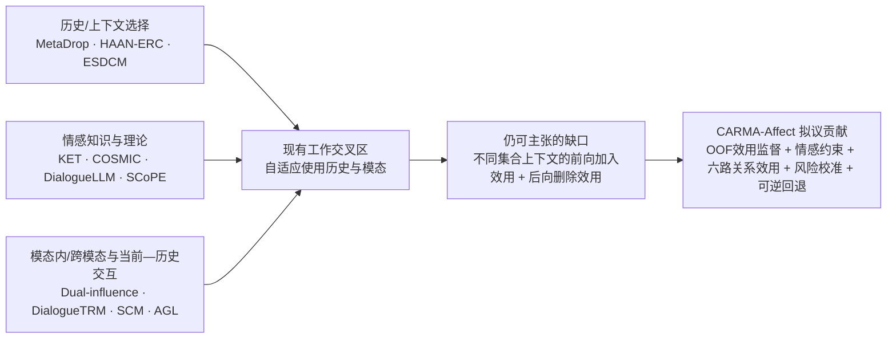

# CARMA-Affect 前三项创新的新颖性审计

> **HISTORICAL NOVELTY AUDIT（2026-08-13）：**本文保留截至 2026-08-07 的查新边界和创新风险判断，不是当前训练执行手册。当前实现/实验以 [最新 Phase A/Phase B 方案](14_最新执行基线与GitHub旧方案差异_2026-08-13.md) 为准：冻结 Qwen3-Omni 三模态只是 Phase A 表征与管线选择，不自动构成创新；情感理论、逐 `h_k` 3×3、真实模态/联合双向效用和两级门控在 Phase B 中接受完整消融检验。本文建议情感专用编码器作为核心主干、旧阶段 A–D 或旧指标口径等冲突项不再作为当前执行要求；查新结论仍须在投稿前更新。

检索截止日期：2026-08-07
审计对象：老师提出的前三项修改要求
审计性质：系统化范围综述（scoping novelty audit），不是法律意义上的专利查新，也不等同于穷尽全球所有数据库的正式系统综述

## 1. 结论先行

### 1.1 总结性判断

在本轮检索到的论文中，**尚未发现一篇情感对话识别论文同时完成以下完整链条**：

1. 在不同历史集合上下文中，同时定义“加入一条历史”的前向效用与“从较完整历史中删除一条历史”的后向效用；
2. 用严格 train-only、group-wise out-of-fold 预测损失构造效用监督；
3. 将情感领域理论或情感专用表征用于预测上述效用及历史失效风险，而不是仅辅助情感分类；
4. 对当前文本、音频、视频与历史文本、音频、视频的关系逐对估计条件效用；
5. 在测试期进行效用预测、风险校准、可逆历史选择与 current-only 安全回退；
6. 最终在 MELD、IEMOCAP、EmotionTalk 等情感任务上报告 Accuracy/F1、逐查询伤害率、尾部 regret 与风险—覆盖。

因此，**完整组合仍有新颖性空间**。但是老师提出的三个短语不能原样分别宣称为创新：

- “双向边际效用”有潜力成为核心方法创新，但必须避免把同一差值换一个符号说成双向；
- “引入情感模型/理论”已有大量先例，单独不新；
- “六路当前—历史模态交互”已有大量高度重叠工作，单独不新。

最稳妥的创新定位是：

> **情感理论约束的、集合条件化的双向反事实历史效用学习**：在不同历史组合中估计每条当前模态—历史模态关系的前向加入收益、后向删除依赖和伤害风险，并用折外监督与风险校准支持可逆选择及 current-only 回退。

### 1.2 新颖性风险评级

| 候选创新 | 单独新颖性 | 与既有工作重叠 | 建议 |
|---|---:|---:|---|
| 双向边际效用 | 中高，但尚需全文排雷 | 中 | 保留为核心，必须给出非平凡的双向定义、折外监督和风险校准 |
| 情感领域模型/理论 | 低 | 高 | 降为领域归纳偏置；服务于效用预测，不宣称首次引入 |
| 六路当前—历史交互 | 低 | 很高 | 降为架构载体；创新应落在每条关系的条件反事实效用，而非 attention/fusion |
| 三者的完整组合 | 中高 | 未发现完全相同工作 | 作为论文主张，但只能写“据我们检索所知”，不能写绝对“世界首次” |

## 2. 双向效用必须怎样定义才不是“同一差值换符号”

令当前查询为 \(x_t\)，候选历史为 \(h_i\)，损失为 \(\ell\)，历史集合为 \(S\) 或 \(T\)。统一规定“正值代表有益”。

前向加入效用：

\[
u^{+}_{t,i\mid S}
=
\ell\bigl(y_t,F^{-g(t)}(x_t,S)\bigr)
-
\ell\bigl(y_t,F^{-g(t)}(x_t,S\cup\{h_i\})\bigr).
\]

后向删除效用：

\[
u^{-}_{t,i\mid T}
=
\ell\bigl(y_t,F^{-g(t)}(x_t,T\setminus\{h_i\})\bigr)
-
\ell\bigl(y_t,F^{-g(t)}(x_t,T)\bigr),
\qquad h_i\in T.
\]

关键约束是：**不能总令 \(T=S\cup\{h_i\}\)**。若这样做，两个量在数学上完全相同，只是观察方向不同，无法支撑方法创新。应从不同大小、不同组成和不同情绪阶段的集合中分别采样 \(S\) 与 \(T\)，学习：

- 候选进入较稀疏上下文时的增益；
- 候选已经嵌入较丰富上下文后，系统对它的依赖；
- 两个效用分布的不对称、符号冲突和集合交互；
- 在情绪转折、模态冲突、低质量音视频条件下，效用是否失稳。

这比普通 attention 权重、top-k 检索分数或一次性的 leave-one-out 消融更强，因为它把“是否使用历史”变成有可观测训练目标、有不确定性输出并可在测试期预测的决策问题。

## 3. 文献格局图

## 4. 最危险的重叠论文

### 4.1 高风险：直接压缩核心表述空间

| 论文 | 已经完成的内容 | 与本方案的重叠 | 尚未发现其完成的内容 | 风险 |
|---|---|---|---|---:|
| [Learning What and When to Drop](https://doi.org/10.1145/3474085.3475661)（ACM MM 2021） | MetaDrop 同时学习模态级和对话上下文中的丢弃决策 | “选择性使用模态和历史”高度重叠 | 未见逐历史、集合条件化的双向损失效用、OOF效用监督和风险校准 | 很高 |
| [Modeling both Intra- and Inter-modal Influence for Real-Time Emotion Detection in Conversations](https://doi.org/10.1145/3394171.3413949)（ACM MM 2020） | 建模当前与历史话语的模态内、跨模态影响及双向信息传播 | 与六路/两两当前—历史交互直接重叠 | “双向传播”不是双向反事实效用，也未见效用监督 | 很高 |
| [HAAN-ERC](https://doi.org/10.1007/s00521-023-08638-2)（Neural Computing and Applications 2023） | 分层自适应注意，弱化历史中的冗余或低价值信息 | 与历史筛选、低价值历史抑制高度重叠 | 未见加入/删除效用标签、风险校准和可逆选择协议 | 很高 |
| [Fusing Pairwise Modalities for Emotion Recognition in Conversations](https://doi.org/10.1016/j.inffus.2024.102306)（Information Fusion 2024） | 显式两两模态融合 | 与“模态两两联系”直接重叠 | 主要是模态融合，不是逐候选历史的集合条件反事实效用 | 高 |
| [Revisiting Disentanglement and Fusion on Modality and Context in Conversational Multimodal Emotion Recognition](https://doi.org/10.1145/3581783.3612053)（ACM MM 2023） | 同时处理模态与上下文的解耦、贡献感知融合和上下文再融合 | 与“分别处理模态/历史再融合”高度重叠 | 未见双向效用监督和风险控制 | 高 |
| [Self-adaptive Context and Modal-interaction Modeling for Multimodal Emotion Recognition](https://doi.org/10.18653/v1/2023.findings-acl.390)（Findings ACL 2023） | 多尺度上下文、三类模态交互、自适应路径选择 | 与上下文和模态交互联合建模高度重叠 | 未见模型相对的加入/删除损失效用 | 很高 |
| [Adaptive Graph Learning for Multimodal Conversational Emotion Detection](https://doi.org/10.1609/aaai.v38i17.29876)（AAAI 2024） | 自适应选择节点与边，建模同/跨模态交互、情绪惯性与模态冲突 | 与六路图结构、动态选择和情感机制高度重叠 | 未见双向反事实效用和校准回退 | 很高 |
| [Revisiting Multimodal Emotion Recognition in Conversation from the Perspectives of Context and Representation Over-Smoothing / ESDCM](https://doi.org/10.2139/ssrn.7239530)（SSRN 2026，预印本） | 明确提出 emotion validity；用情绪转折驱动动态上下文，抑制过时情绪传播 | 与“历史并非总有效”和情感理论约束的历史选择极度接近 | 摘要未显示逐候选双向反事实效用、OOF监督或风险校准 | 极高 |
| [A Unified Approach for Multimodal Emotion Recognition Using Counterfactual Learning](https://doi.org/10.1016/j.image.2026.117625)（Signal Processing: Image Communication 2026） | 标题和关键词明确涉及反事实学习与多模态情感识别 | 压缩“首次把反事实用于多模态情感识别”的表述空间 | 当前可访问元数据无摘要且全文受限；是否涉及历史加入/删除效用仍需全文核查 | 极高，待全文 |

### 4.2 中高风险：2025–2026 年的新近近邻

| 论文 | 与本方案的关系 | 结论 |
|---|---|---|
| [Causal-ERC](https://doi.org/10.1609/aaai.v40i37.40402)（AAAI 2026） | 各模态内建模上下文，并用因果提示改善长对话 | 与“情感领域因果/上下文模型”和模态历史分路相邻，但不是已证实的反事实边际效用 |
| [SCoPE: Shift-Aware Speaker-Conditioned Priors for ERC](https://arxiv.org/abs/2607.20445)（arXiv 2026） | 用说话人情绪历史形成先验，以情绪转折预测调节历史先验与当前多模态证据 | 与情绪惯性、转折、历史可靠性高度相邻；未见逐历史双向效用 |
| [DialogueLLM](https://doi.org/10.1016/j.neunet.2025.107901)（Neural Networks 2025） | 上下文与情感知识调优大模型 | 证明“情感知识模型”本身不是新贡献 |
| [DialogueMLLM](https://doi.org/10.1109/access.2025.3591447)（IEEE Access 2025） | 指令调优多模态大模型用于对话情感识别 | 进一步压缩“使用情感大模型”的新颖性空间 |
| [ECERC](https://doi.org/10.18653/v1/2025.acl-long.102)（ACL 2025） | Evidence-Cause Attention 建模情感证据与原因 | 与情感因果证据建模相邻；不是历史效用学习 |
| [GAT-CRESA](https://doi.org/10.1007/s40747-025-01903-y)（Complex & Intelligent Systems 2025） | 全局上下文推理、说话人/全局情绪转折、多任务学习；报告 IEMOCAP 72.77% ACC、MELD 65.44% ACC | 情绪转折理论和上下文动态图已高度成熟；可作为必须超过或公平对比的强基线 |
| [CoRe-KD](https://arxiv.org/abs/2605.29590)（arXiv 2026） | 对缺失/不可靠模态进行完整视图蒸馏和非语言冲突训练 | 主要解决模态缺失而非历史效用，但与模态可靠性和安全性相邻 |

## 5. 情感理论与情感模型：已有工作

以下论文表明“引入情感知识、情绪动态、情绪转折或情感专用预训练模型”已经是成熟路线：

1. [Past, Present, and Future: Conversational Emotion Recognition through Structural Modeling of Psychological Knowledge](https://doi.org/10.18653/v1/2021.findings-emnlp.104)
2. [Knowledge-Enriched Transformer for Emotion Detection in Textual Conversations](https://doi.org/10.18653/v1/d19-1016)
3. [COSMIC: Commonsense Knowledge for Emotion Identification in Conversations](https://doi.org/10.18653/v1/2020.findings-emnlp.224)
4. [Sentiment-, Emotion-, and Context-Guided Knowledge Selection Framework](https://doi.org/10.1109/taffc.2022.3223517)
5. [Shapes of Emotions: Multimodal Emotion Recognition in Conversations via Emotion Shifts](https://aclanthology.org/2022.mmmpie-1.6/)
6. [CFN-ESA: A Cross-Modal Fusion Network With Emotion-Shift Awareness](https://doi.org/10.1109/taffc.2024.3389453)
7. [emotion2vec: Self-Supervised Pre-Training for Speech Emotion Representation](https://doi.org/10.18653/v1/2024.findings-acl.931)
8. [Emotion-LLaMA](https://arxiv.org/abs/2406.11161)
9. [EmoBERTa](https://arxiv.org/abs/2108.12009)

因此，第二点应改写为：

> 我们不是首次把情感知识引入分类器，而是把情绪惯性、情绪转折、VAD距离、情感原因/评价和模态情感一致性用作**双向历史效用及失效风险的结构约束和可检验机制变量**。

建议优先采用可审计的小型情感组件：文本用 EmoBERTa/SenticNet 或情感原因表征，音频用 emotion2vec，视频用表情/动作单元与 VAD 投影；大模型只做冻结基线或教师，不作为不可复现的核心。

## 6. 当前—历史多模态建模：已有工作

以下工作已经覆盖当前/历史记忆、模态内与跨模态关系、图结构或动态融合：

1. [Conversational Memory Network](https://doi.org/10.18653/v1/n18-1193)
2. [ICON](https://doi.org/10.18653/v1/d18-1280)
3. [DialogueTRM](https://doi.org/10.18653/v1/2021.findings-emnlp.229)
4. [MMGCN](https://doi.org/10.18653/v1/2021.acl-long.440)
5. [COGMEN](https://doi.org/10.18653/v1/2022.naacl-main.306)
6. [CMCF-SRNet](https://doi.org/10.18653/v1/2023.acl-long.732)
7. [GraphCFC](https://doi.org/10.1109/tmm.2023.3260635)
8. [MM-DFN](https://doi.org/10.1109/icassp43922.2022.9747397)
9. [Memory Fusion Network](https://doi.org/10.1609/aaai.v32i1.12021)
10. [Multimodal Transformer](https://doi.org/10.18653/v1/p19-1656)
11. [MISA](https://doi.org/10.1145/3394171.3413678)

因此，第三点应改写为：

> 六路分离编码与 3×3 当前—历史关系图只是基础结构。新贡献是为每条关系输出前向加入效用、后向删除效用、不确定性和伤害概率，并检验跨模态关系是否在情绪转折或模态冲突条件下改变历史价值。

## 7. 逐项重叠矩阵

符号：✓=明确具备；△=部分或相邻；?=当前公开材料不足；—=未发现。

| 方法 | 历史/上下文选择 | 情感理论/知识 | 当前—历史模态交互 | 反事实学习 | 前向加入效用 | 后向删除效用 | OOF效用监督 | 风险校准/回退 |
|---|---:|---:|---:|---:|---:|---:|---:|---:|
| MetaDrop | ✓ | — | △ | — | — | — | — | — |
| Dual intra/inter-modal influence | — | △ | ✓ | — | — | — | — | — |
| HAAN-ERC | ✓ | — | ✓ | — | — | — | — | — |
| Pairwise modalities | — | — | △ | — | — | — | — | — |
| Disentanglement & Fusion | △ | — | ✓ | — | — | — | — | — |
| Self-adaptive Context/Modal Interaction | ✓ | — | ✓ | — | — | — | — | — |
| Adaptive Graph Learning | ✓ | ✓ | ✓ | — | — | — | — | — |
| ESDCM | ✓ | ✓ | △ | — | — | — | — | — |
| Unified Counterfactual Learning 2026 | ? | ? | △ | ✓ | ? | ? | ? | ? |
| Causal-ERC | △ | △ | ✓ | △ | — | — | — | — |
| SCoPE | △ | ✓ | △ | — | — | — | — | — |
| 拟议 CARMA-Affect | ✓ | ✓ | ✓ | ✓ | ✓ | ✓ | ✓ | ✓ |

## 8. 可以安全写入论文的创新表述

不建议写：

- “首次提出双向边际效用”；
- “首次在情感识别中引入情感理论”；
- “首次分别建模当前文本/音频/视频与历史文本/音频/视频”；
- “首次发现历史会伤害情感识别”；
- “首次使用反事实学习进行多模态情感识别”。

建议写成三个相互依赖、不能拆开的贡献：

1. **集合条件化的双向历史效用。** 在不同历史组合中学习候选的前向加入收益与后向删除依赖，显式表征集合交互、方向不对称和伤害概率。
2. **情感机制约束的效用预测。** 情绪惯性、转折、VAD距离、情感原因与模态一致性不是直接堆入分类器，而是约束历史效用与失效风险。
3. **关系级而非权重级的六路决策。** 对 3×3 当前—历史模态关系估计可校准的效用分布，并在风险过高时执行可逆选择或退回 current-only。

论文中的保守表述可为：

> 据我们截至 2026 年 8 月 7 日对 OpenAlex、Crossref、arXiv、ACL Anthology、Semantic Scholar 网页及通用网页检索的结果，现有 MERC 研究已经广泛探索上下文选择、情感知识、情绪转折和跨模态交互，但我们尚未发现工作在不同历史集合上下文中联合学习前向加入效用与后向删除效用，并以折外损失监督、情感机制约束和校准风险回退支持逐查询的可逆历史使用。

## 9. 后续完整科研流程

### 阶段 A：完成查新闭环

1. 获取并全文阅读 2026 年 *A Unified Approach for Multimodal Emotion Recognition Using Counterfactual Learning*；这是当前唯一不能仅凭摘要排除的红色条目。
2. 对 ESDCM、MetaDrop、HAAN-ERC、Dual-influence、SCM、AGL、SCoPE 做方法公式级比对。
3. 做前向/后向引用追踪，并在论文投稿前重新检索一次 2026 年新增工作。

### 阶段 B：冻结研究问题与方法合同

1. 写清前向与后向效用的不同集合采样合同。
2. 规定所有效用标签只来自 train-only group cross-fitting。
3. 冻结六路编码、3×3关系、情感机制变量和风险校准协议。
4. 预先定义失败判据：若双向头不优于单向头或简单 recency/similarity，不能宣称方法成功。

### 阶段 C：实验

1. 数据集：MELD、IEMOCAP、EmotionTalk；可增加 MOSI/MOSEI 作非对话补充，不替代主任务。
2. 主指标：Accuracy、weighted-F1、macro-F1。
3. 安全指标：历史伤害率、平均/分位数 regret、p90/p99、风险—覆盖、current-only 回退率。
4. 必要基线：current-only、all-history、recency、similarity、随机历史、MetaDrop式门控、HAAN式注意、SCM/AGL、单向效用、Shapley/leave-one-out近邻、oracle。
5. 必要消融：无情感理论、通用编码器替代情感编码器、无跨模态关系、只有前向、只有后向、同一集合配对的平凡“双向”、无校准、无回退。
6. 统计：dialogue/speaker 聚类 bootstrap、五随机种子、效应量与95%置信区间、多重比较控制。

### 阶段 D：可反驳性判定

只有同时满足以下条件，才保留“方法创新”路线：

- 双向模型相对最强单向效用模型提高情感分类 Accuracy/F1；
- 在相同覆盖率下显著降低历史伤害率与尾部 regret；
- 情感理论组件带来跨数据集、跨随机种子稳定增益，而不是只对某一数据集调参；
- 六路关系效用优于普通 attention/fusion 权重，并能解释转折与模态冲突场景；
- 至少一个非平凡覆盖率（建议 ≥10% 或预注册阈值）下，校准后的策略不劣于 current-only。

如果不满足，则将论文降级为“情感历史负迁移 benchmark/诊断研究”，不夸大为安全历史选择方法。

## 10. 检索方法与限制

- 数据源：OpenAlex、Crossref、arXiv、ACL Anthology、Semantic Scholar 网页和通用网页补充检索。
- 关键词族：bidirectional/marginal utility、counterfactual context/history、context/history selection、modality-specific history、intra/inter-modal influence、pairwise modality、emotion theory/appraisal/VAD/emotion shift/psychological knowledge、Shapley/leave-one-out/data valuation、risk calibration。
- 本地保存：82 个查询结果文件；数据库返回记录累计 1,868 条；按 DOI/标题抽取得到约 904 个唯一记录。由于每个 API 查询设置了结果上限，该数字是候选池而不是数据库全集。
- Semantic Scholar API 在检索日返回 429，已改用其网页以及 OpenAlex、Crossref、arXiv 和出版方元数据交叉核验。
- 2026 年反事实论文全文受限，当前只能核验标题、作者、期刊和关键词，不能据此断言其方法与本方案不同。
- “没有检索到”不是“绝对不存在”。最终论文必须使用“据我们检索所知”，并在投稿前更新查新。
